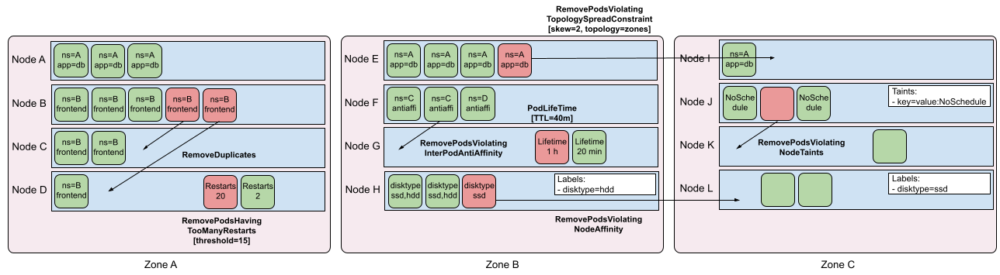

[](https://goreportcard.com/report/sigs.k8s.io/descheduler)


# Descheduler for Kubernetes

Scheduling in Kubernetes is the process of binding pending pods to nodes, and is performed by
a component of Kubernetes called kube-scheduler. The scheduler's decisions, whether or where a
pod can or can not be scheduled, are guided by its configurable policy which comprises of set of
rules, called predicates and priorities. The scheduler's decisions are influenced by its view of
a Kubernetes cluster at that point of time when a new pod appears for scheduling.
As Kubernetes clusters are very dynamic and their state changes over time, there may be desire
to move already running pods to some other nodes for various reasons:

* Some nodes are under or over utilized.
* The original scheduling decision does not hold true any more, as taints or labels are added to
or removed from nodes, pod/node affinity requirements are not satisfied any more.
* Some nodes failed and their pods moved to other nodes.
* New nodes are added to clusters.

Consequently, there might be several pods scheduled on less desired nodes in a cluster.
Descheduler, based on its policy, finds pods that can be moved and evicts them. Please
note, in current implementation, descheduler does not schedule replacement of evicted pods
but relies on the default scheduler for that.

Table of Contents
=================
<!-- toc -->
- [Quick Start](#quick-start)
  - [Run As A Job](#run-as-a-job)
  - [Run As A CronJob](#run-as-a-cronjob)
  - [Run As A Deployment](#run-as-a-deployment)
  - [Install Using Helm](#install-using-helm)
  - [Install Using Kustomize](#install-using-kustomize)
- [User Guide](#user-guide)
- [Policy and Strategies](#policy-and-strategies)
  - [RemoveDuplicates](#removeduplicates)
  - [LowNodeUtilization](#lownodeutilization)
  - [HighNodeUtilization](#highnodeutilization)
  - [RemovePodsViolatingInterPodAntiAffinity](#removepodsviolatinginterpodantiaffinity)
  - [RemovePodsViolatingNodeAffinity](#removepodsviolatingnodeaffinity)
  - [RemovePodsViolatingNodeTaints](#removepodsviolatingnodetaints)
  - [RemovePodsViolatingTopologySpreadConstraint](#removepodsviolatingtopologyspreadconstraint)
  - [RemovePodsHavingTooManyRestarts](#removepodshavingtoomanyrestarts)
  - [PodLifeTime](#podlifetime)
  - [RemoveFailedPods](#removefailedpods)
- [Filter Pods](#filter-pods)
  - [Namespace filtering](#namespace-filtering)
  - [Priority filtering](#priority-filtering)
  - [Label filtering](#label-filtering)
  - [Node Fit filtering](#node-fit-filtering)
- [Pod Evictions](#pod-evictions)
  - [Pod Disruption Budget (PDB)](#pod-disruption-budget-pdb)
- [Metrics](#metrics)
- [Compatibility Matrix](#compatibility-matrix)
- [Getting Involved and Contributing](#getting-involved-and-contributing)
  - [Communicating With Contributors](#communicating-with-contributors)
- [Roadmap](#roadmap)
  - [Code of conduct](#code-of-conduct)
<!-- /toc -->

## Quick Start

The descheduler can be run as a `Job`, `CronJob`, or `Deployment` inside of a k8s cluster. It has the
advantage of being able to be run multiple times without needing user intervention.
The descheduler pod is run as a critical pod in the `kube-system` namespace to avoid
being evicted by itself or by the kubelet.

### Run As A Job

```
kubectl create -f kubernetes/base/rbac.yaml
kubectl create -f kubernetes/base/configmap.yaml
kubectl create -f kubernetes/job/job.yaml
```

### Run As A CronJob

```
kubectl create -f kubernetes/base/rbac.yaml
kubectl create -f kubernetes/base/configmap.yaml
kubectl create -f kubernetes/cronjob/cronjob.yaml
```

### Run As A Deployment

```
kubectl create -f kubernetes/base/rbac.yaml
kubectl create -f kubernetes/base/configmap.yaml
kubectl create -f kubernetes/deployment/deployment.yaml
```

### Install Using Helm

Starting with release v0.18.0 there is an official helm chart that can be used to install the
descheduler. See the [helm chart README](https://github.com/kubernetes-sigs/descheduler/blob/master/charts/descheduler/README.md) for detailed instructions.

The descheduler helm chart is also listed on the [artifact hub](https://artifacthub.io/packages/helm/descheduler/descheduler).

### Install Using Kustomize

You can use kustomize to install descheduler.
See the [resources | Kustomize](https://kubectl.docs.kubernetes.io/references/kustomize/resource/) for detailed instructions.

Run As A Job
```
kustomize build 'github.com/kubernetes-sigs/descheduler/kubernetes/job?ref=v0.22.0' | kubectl apply -f -
```

Run As A CronJob
```
kustomize build 'github.com/kubernetes-sigs/descheduler/kubernetes/cronjob?ref=v0.22.0' | kubectl apply -f -
```

Run As A Deployment
```
kustomize build 'github.com/kubernetes-sigs/descheduler/kubernetes/deployment?ref=v0.22.0' | kubectl apply -f -
```

## User Guide

See the [user guide](docs/user-guide.md) in the `/docs` directory.

## Policy and Strategies

Descheduler's policy is configurable and includes strategies that can be enabled or disabled. By default, all strategies are enabled.

The policy includes a common configuration that applies to all the strategies:
| Name | Default Value | Description |
|------|---------------|-------------|
| `nodeSelector` | `nil` | limiting the nodes which are processed |
| `evictLocalStoragePods` | `false` | allows eviction of pods with local storage |
| `evictSystemCriticalPods` | `false` | [Warning: Will evict Kubernetes system pods] allows eviction of pods with any priority, including system pods like kube-dns |
| `ignorePvcPods` | `false` | set whether PVC pods should be evicted or ignored |
| `maxNoOfPodsToEvictPerNode` | `nil` | maximum number of pods evicted from each node (summed through all strategies) |

As part of the policy, the parameters associated with each strategy can be configured.
See each strategy for details on available parameters.

**Policy:**

```yaml
apiVersion: "descheduler/v1alpha1"
kind: "DeschedulerPolicy"
nodeSelector: prod=dev
evictLocalStoragePods: true
evictSystemCriticalPods: true
maxNoOfPodsToEvictPerNode: 40
ignorePvcPods: false
strategies:
  ...
```

The following diagram provides a visualization of most of the strategies to help
categorize how strategies fit together.



### RemoveDuplicates

This strategy makes sure that there is only one pod associated with a ReplicaSet (RS),
ReplicationController (RC), StatefulSet, or Job running on the same node. If there are more,
those duplicate pods are evicted for better spreading of pods in a cluster. This issue could happen
if some nodes went down due to whatever reasons, and pods on them were moved to other nodes leading to
more than one pod associated with a RS or RC, for example, running on the same node. Once the failed nodes
are ready again, this strategy could be enabled to evict those duplicate pods.

It provides one optional parameter, `excludeOwnerKinds`, which is a list of OwnerRef `Kind`s. If a pod
has any of these `Kind`s listed as an `OwnerRef`, that pod will not be considered for eviction. Note that
pods created by Deployments are considered for eviction by this strategy. The `excludeOwnerKinds` parameter
should include `ReplicaSet` to have pods created by Deployments excluded.

**Parameters:**

|Name|Type|
|---|---|
|`excludeOwnerKinds`|list(string)|
|`namespaces`|(see [namespace filtering](#namespace-filtering))|
|`thresholdPriority`|int (see [priority filtering](#priority-filtering))|
|`thresholdPriorityClassName`|string (see [priority filtering](#priority-filtering))|
|`nodeFit`|bool (see [node fit filtering](#node-fit-filtering))|

**Example:**
```yaml
apiVersion: "descheduler/v1alpha1"
kind: "DeschedulerPolicy"
strategies:
  "RemoveDuplicates":
     enabled: true
     params:
       removeDuplicates:
         excludeOwnerKinds:
         - "ReplicaSet"
```

### LowNodeUtilization

This strategy finds nodes that are under utilized and evicts pods, if possible, from other nodes
in the hope that recreation of evicted pods will be scheduled on these underutilized nodes. The
parameters of this strategy are configured under `nodeResourceUtilizationThresholds`.

The under utilization of nodes is determined by a configurable threshold `thresholds`. The threshold
`thresholds` can be configured for cpu, memory, number of pods, and extended resources in terms of percentage (the percentage is
calculated as the current resources requested on the node vs [total allocatable](https://kubernetes.io/docs/concepts/architecture/nodes/#capacity).
For pods, this means the number of pods on the node as a fraction of the pod capacity set for that node).

If a node's usage is below threshold for all (cpu, memory, number of pods and extended resources), the node is considered underutilized.
Currently, pods request resource requirements are considered for computing node resource utilization.

There is another configurable threshold, `targetThresholds`, that is used to compute those potential nodes
from where pods could be evicted. If a node's usage is above targetThreshold for any (cpu, memory, number of pods, or extended resources),
the node is considered over utilized. Any node between the thresholds, `thresholds` and `targetThresholds` is
considered appropriately utilized and is not considered for eviction. The threshold, `targetThresholds`,
can be configured for cpu, memory, and number of pods too in terms of percentage.

These thresholds, `thresholds` and `targetThresholds`, could be tuned as per your cluster requirements. Note that this
strategy evicts pods from `overutilized nodes` (those with usage above `targetThresholds`) to `underutilized nodes`
(those with usage below `thresholds`), it will abort if any number of `underutilized nodes` or `overutilized nodes` is zero.

**Parameters:**

|Name|Type|
|---|---|
|`thresholds`|map(string:int)|
|`targetThresholds`|map(string:int)|
|`numberOfNodes`|int|
|`thresholdPriority`|int (see [priority filtering](#priority-filtering))|
|`thresholdPriorityClassName`|string (see [priority filtering](#priority-filtering))|
|`nodeFit`|bool (see [node fit filtering](#node-fit-filtering))|

**Example:**

```yaml
apiVersion: "descheduler/v1alpha1"
kind: "DeschedulerPolicy"
strategies:
  "LowNodeUtilization":
     enabled: true
     params:
       nodeResourceUtilizationThresholds:
         thresholds:
           "cpu" : 20
           "memory": 20
           "pods": 20
         targetThresholds:
           "cpu" : 50
           "memory": 50
           "pods": 50
```

Policy should pass the following validation checks:
* Three basic native types of resources are supported: `cpu`, `memory` and `pods`.
If any of these resource types is not specified, all its thresholds default to 100% to avoid nodes going from underutilized to overutilized.
* Extended resources are supported. For example, resource type `nvidia.com/gpu` is specified for GPU node utilization. Extended resources are optional,
and will not be used to compute node's usage if it's not specified in `thresholds` and `targetThresholds` explicitly.
* `thresholds` or `targetThresholds` can not be nil and they must configure exactly the same types of resources.
* The valid range of the resource's percentage value is \[0, 100\]
* Percentage value of `thresholds` can not be greater than `targetThresholds` for the same resource.

There is another parameter associated with the `LowNodeUtilization` strategy, called `numberOfNodes`.
This parameter can be configured to activate the strategy only when the number of under utilized nodes
are above the configured value. This could be helpful in large clusters where a few nodes could go
under utilized frequently or for a short period of time. By default, `numberOfNodes` is set to zero.

### HighNodeUtilization

This strategy finds nodes that are under utilized and evicts pods from the nodes in the hope that these pods will be 
scheduled compactly into fewer nodes.  Used in conjunction with node auto-scaling, this strategy is intended to help 
trigger down scaling of under utilized nodes.
This strategy **must** be used with the scheduler strategy `MostRequestedPriority`. The parameters of this strategy are 
configured under `nodeResourceUtilizationThresholds`.

The under utilization of nodes is determined by a configurable threshold `thresholds`. The threshold
`thresholds` can be configured for cpu, memory, number of pods, and extended resources in terms of percentage. The percentage is
calculated as the current resources requested on the node vs [total allocatable](https://kubernetes.io/docs/concepts/architecture/nodes/#capacity).
For pods, this means the number of pods on the node as a fraction of the pod capacity set for that node.

If a node's usage is below threshold for all (cpu, memory, number of pods and extended resources), the node is considered underutilized.
Currently, pods request resource requirements are considered for computing node resource utilization.
Any node above `thresholds` is considered appropriately utilized and is not considered for eviction.

The `thresholds` param could be tuned as per your cluster requirements. Note that this
strategy evicts pods from `underutilized nodes` (those with usage below `thresholds`)
so that they can be recreated in appropriately utilized nodes.
The strategy will abort if any number of `underutilized nodes` or `appropriately utilized nodes` is zero.

**Parameters:**

|Name|Type|
|---|---|
|`thresholds`|map(string:int)|
|`numberOfNodes`|int|
|`thresholdPriority`|int (see [priority filtering](#priority-filtering))|
|`thresholdPriorityClassName`|string (see [priority filtering](#priority-filtering))|
|`nodeFit`|bool (see [node fit filtering](#node-fit-filtering))|

**Example:**

```yaml
apiVersion: "descheduler/v1alpha1"
kind: "DeschedulerPolicy"
strategies:
  "HighNodeUtilization":
     enabled: true
     params:
       nodeResourceUtilizationThresholds:
         thresholds:
           "cpu" : 20
           "memory": 20
           "pods": 20
```

Policy should pass the following validation checks:
* Three basic native types of resources are supported: `cpu`, `memory` and `pods`. If any of these resource types is not specified, all its thresholds default to 100%.
* Extended resources are supported. For example, resource type `nvidia.com/gpu` is specified for GPU node utilization. Extended resources are optional, and will not be used to compute node's usage if it's not specified in `thresholds` explicitly.
* `thresholds` can not be nil.
* The valid range of the resource's percentage value is \[0, 100\]

There is another parameter associated with the `HighNodeUtilization` strategy, called `numberOfNodes`.
This parameter can be configured to activate the strategy only when the number of under utilized nodes
is above the configured value. This could be helpful in large clusters where a few nodes could go
under utilized frequently or for a short period of time. By default, `numberOfNodes` is set to zero.

### RemovePodsViolatingInterPodAntiAffinity

This strategy makes sure that pods violating interpod anti-affinity are removed from nodes. For example,
if there is podA on a node and podB and podC (running on the same node) have anti-affinity rules which prohibit
them to run on the same node, then podA will be evicted from the node so that podB and podC could run. This
issue could happen, when the anti-affinity rules for podB and podC are created when they are already running on
node.

**Parameters:**

|Name|Type|
|---|---|
|`thresholdPriority`|int (see [priority filtering](#priority-filtering))|
|`thresholdPriorityClassName`|string (see [priority filtering](#priority-filtering))|
|`namespaces`|(see [namespace filtering](#namespace-filtering))|
|`labelSelector`|(see [label filtering](#label-filtering))|
|`nodeFit`|bool (see [node fit filtering](#node-fit-filtering))|

**Example:**

```yaml
apiVersion: "descheduler/v1alpha1"
kind: "DeschedulerPolicy"
strategies:
  "RemovePodsViolatingInterPodAntiAffinity":
     enabled: true
```

### RemovePodsViolatingNodeAffinity

This strategy makes sure all pods violating
[node affinity](https://kubernetes.io/docs/concepts/configuration/assign-pod-node/#node-affinity)
are eventually removed from nodes. Node affinity rules allow a pod to specify
`requiredDuringSchedulingIgnoredDuringExecution` type, which tells the scheduler
to respect node affinity when scheduling the pod but kubelet to ignore
in case node changes over time and no longer respects the affinity.
When enabled, the strategy serves as a temporary implementation
of `requiredDuringSchedulingRequiredDuringExecution` and evicts pod for kubelet
that no longer respects node affinity.

For example, there is podA scheduled on nodeA which satisfies the node
affinity rule `requiredDuringSchedulingIgnoredDuringExecution` at the time
of scheduling. Over time nodeA stops to satisfy the rule. When the strategy gets
executed and there is another node available that satisfies the node affinity rule,
podA gets evicted from nodeA.

**Parameters:**

|Name|Type|
|---|---|
|`nodeAffinityType`|list(string)|
|`thresholdPriority`|int (see [priority filtering](#priority-filtering))|
|`thresholdPriorityClassName`|string (see [priority filtering](#priority-filtering))|
|`namespaces`|(see [namespace filtering](#namespace-filtering))|
|`labelSelector`|(see [label filtering](#label-filtering))|
|`nodeFit`|bool (see [node fit filtering](#node-fit-filtering))|

**Example:**

```yaml
apiVersion: "descheduler/v1alpha1"
kind: "DeschedulerPolicy"
strategies:
  "RemovePodsViolatingNodeAffinity":
    enabled: true
    params:
      nodeAffinityType:
      - "requiredDuringSchedulingIgnoredDuringExecution"
```

### RemovePodsViolatingNodeTaints

This strategy makes sure that pods violating NoSchedule taints on nodes are removed. For example there is a
pod "podA" with a toleration to tolerate a taint ``key=value:NoSchedule`` scheduled and running on the tainted
node. If the node's taint is subsequently updated/removed, taint is no longer satisfied by its pods' tolerations
and will be evicted.

**Parameters:**

|Name|Type|
|---|---|
|`thresholdPriority`|int (see [priority filtering](#priority-filtering))|
|`thresholdPriorityClassName`|string (see [priority filtering](#priority-filtering))|
|`namespaces`|(see [namespace filtering](#namespace-filtering))|
|`labelSelector`|(see [label filtering](#label-filtering))|
|`nodeFit`|bool (see [node fit filtering](#node-fit-filtering))|

**Example:**

````yaml
apiVersion: "descheduler/v1alpha1"
kind: "DeschedulerPolicy"
strategies:
  "RemovePodsViolatingNodeTaints":
    enabled: true
````

### RemovePodsViolatingTopologySpreadConstraint

This strategy makes sure that pods violating [topology spread constraints](https://kubernetes.io/docs/concepts/workloads/pods/pod-topology-spread-constraints/)
are evicted from nodes. Specifically, it tries to evict the minimum number of pods required to balance topology domains to within each constraint's `maxSkew`.
This strategy requires k8s version 1.18 at a minimum.

By default, this strategy only deals with hard constraints, setting parameter `includeSoftConstraints` to `true` will
include soft constraints.

Strategy parameter `labelSelector` is not utilized when balancing topology domains and is only applied during eviction to determine if the pod can be evicted.

**Parameters:**

|Name|Type|
|---|---|
|`includeSoftConstraints`|bool|
|`thresholdPriority`|int (see [priority filtering](#priority-filtering))|
|`thresholdPriorityClassName`|string (see [priority filtering](#priority-filtering))|
|`namespaces`|(see [namespace filtering](#namespace-filtering))|
|`labelSelector`|(see [label filtering](#label-filtering))|
|`nodeFit`|bool (see [node fit filtering](#node-fit-filtering))|

**Example:**

```yaml
apiVersion: "descheduler/v1alpha1"
kind: "DeschedulerPolicy"
strategies:
  "RemovePodsViolatingTopologySpreadConstraint":
     enabled: true
     params:
       includeSoftConstraints: false
```


### RemovePodsHavingTooManyRestarts

This strategy makes sure that pods having too many restarts are removed from nodes. For example a pod with EBS/PD that
can't get the volume/disk attached to the instance, then the pod should be re-scheduled to other nodes. Its parameters
include `podRestartThreshold`, which is the number of restarts (summed over all eligible containers) at which a pod
should be evicted, and `includingInitContainers`, which determines whether init container restarts should be factored
into that calculation.

**Parameters:**

|Name|Type|
|---|---|
|`podRestartThreshold`|int|
|`includingInitContainers`|bool|
|`thresholdPriority`|int (see [priority filtering](#priority-filtering))|
|`thresholdPriorityClassName`|string (see [priority filtering](#priority-filtering))|
|`namespaces`|(see [namespace filtering](#namespace-filtering))|
|`labelSelector`|(see [label filtering](#label-filtering))|
|`nodeFit`|bool (see [node fit filtering](#node-fit-filtering))|

**Example:**

```yaml
apiVersion: "descheduler/v1alpha1"
kind: "DeschedulerPolicy"
strategies:
  "RemovePodsHavingTooManyRestarts":
     enabled: true
     params:
       podsHavingTooManyRestarts:
         podRestartThreshold: 100
         includingInitContainers: true
```

### PodLifeTime

This strategy evicts pods that are older than `maxPodLifeTimeSeconds`.

You can also specify `podStatusPhases` to `only` evict pods with specific `StatusPhases`, currently this parameter is limited
to `Running` and `Pending`.

**Parameters:**

|Name|Type|
|---|---|
|`maxPodLifeTimeSeconds`|int|
|`podStatusPhases`|list(string)|
|`thresholdPriority`|int (see [priority filtering](#priority-filtering))|
|`thresholdPriorityClassName`|string (see [priority filtering](#priority-filtering))|
|`namespaces`|(see [namespace filtering](#namespace-filtering))|
|`labelSelector`|(see [label filtering](#label-filtering))|

**Example:**

```yaml
apiVersion: "descheduler/v1alpha1"
kind: "DeschedulerPolicy"
strategies:
  "PodLifeTime":
     enabled: true
     params:
       podLifeTime:
         maxPodLifeTimeSeconds: 86400
         podStatusPhases:
         - "Pending"
```

### RemoveFailedPods

This strategy evicts pods that are in failed status phase.
You can provide an optional parameter to filter by failed `reasons`.
`reasons` can be expanded to include reasons of InitContainers as well by setting the optional parameter `includingInitContainers` to `true`.
You can specify an optional parameter `minPodLifeTimeSeconds` to evict pods that are older than specified seconds.
Lastly, you can specify the optional parameter `excludeOwnerKinds` and if a pod
has any of these `Kind`s listed as an `OwnerRef`, that pod will not be considered for eviction.

**Parameters:**

|Name|Type|
|---|---|
|`minPodLifeTimeSeconds`|uint|
|`excludeOwnerKinds`|list(string)|
|`reasons`|list(string)|
|`includingInitContainers`|bool|
|`thresholdPriority`|int (see [priority filtering](#priority-filtering))|
|`thresholdPriorityClassName`|string (see [priority filtering](#priority-filtering))|
|`namespaces`|(see [namespace filtering](#namespace-filtering))|
|`labelSelector`|(see [label filtering](#label-filtering))|
|`nodeFit`|bool (see [node fit filtering](#node-fit-filtering))|

**Example:**

```yaml
apiVersion: "descheduler/v1alpha1"
kind: "DeschedulerPolicy"
strategies:
  "RemoveFailedPods":
     enabled: true
     params:
       failedPods:
         reasons:
         - "NodeAffinity"
         includingInitContainers: true
         excludeOwnerKinds:
         - "Job"
         minPodLifeTimeSeconds: 3600
```

## Filter Pods

### Namespace filtering

The following strategies accept a `namespaces` parameter which allows to specify a list of including, resp. excluding namespaces:
* `PodLifeTime`
* `RemovePodsHavingTooManyRestarts`
* `RemovePodsViolatingNodeTaints`
* `RemovePodsViolatingNodeAffinity`
* `RemovePodsViolatingInterPodAntiAffinity`
* `RemoveDuplicates`
* `RemovePodsViolatingTopologySpreadConstraint`
* `RemoveFailedPods`

For example:

```yaml
apiVersion: "descheduler/v1alpha1"
kind: "DeschedulerPolicy"
strategies:
  "PodLifeTime":
     enabled: true
     params:
        podLifeTime:
          maxPodLifeTimeSeconds: 86400
        namespaces:
          include:
          - "namespace1"
          - "namespace2"
```

In the examples `PodLifeTime` gets executed only over `namespace1` and `namespace2`.
The similar holds for `exclude` field:

```yaml
apiVersion: "descheduler/v1alpha1"
kind: "DeschedulerPolicy"
strategies:
  "PodLifeTime":
     enabled: true
     params:
        podLifeTime:
          maxPodLifeTimeSeconds: 86400
        namespaces:
          exclude:
          - "namespace1"
          - "namespace2"
```

The strategy gets executed over all namespaces but `namespace1` and `namespace2`.

It's not allowed to compute `include` with `exclude` field.

### Priority filtering

All strategies are able to configure a priority threshold, only pods under the threshold can be evicted. You can
specify this threshold by setting `thresholdPriorityClassName`(setting the threshold to the value of the given
priority class) or `thresholdPriority`(directly setting the threshold) parameters. By default, this threshold
is set to the value of `system-cluster-critical` priority class.

Note: Setting `evictSystemCriticalPods` to true disables priority filtering entirely.

E.g.

Setting `thresholdPriority`
```yaml
apiVersion: "descheduler/v1alpha1"
kind: "DeschedulerPolicy"
strategies:
  "PodLifeTime":
     enabled: true
     params:
        podLifeTime:
          maxPodLifeTimeSeconds: 86400
        thresholdPriority: 10000
```

Setting `thresholdPriorityClassName`
```yaml
apiVersion: "descheduler/v1alpha1"
kind: "DeschedulerPolicy"
strategies:
  "PodLifeTime":
     enabled: true
     params:
        podLifeTime:
          maxPodLifeTimeSeconds: 86400
        thresholdPriorityClassName: "priorityclass1"
```

Note that you can't configure both `thresholdPriority` and `thresholdPriorityClassName`, if the given priority class
does not exist, descheduler won't create it and will throw an error.

### Label filtering

The following strategies can configure a [standard kubernetes labelSelector](https://kubernetes.io/docs/reference/generated/kubernetes-api/v1.22/#labelselector-v1-meta)
to filter pods by their labels:

* `PodLifeTime`
* `RemovePodsHavingTooManyRestarts`
* `RemovePodsViolatingNodeTaints`
* `RemovePodsViolatingNodeAffinity`
* `RemovePodsViolatingInterPodAntiAffinity`
* `RemovePodsViolatingTopologySpreadConstraint`
* `RemoveFailedPods`

This allows running strategies among pods the descheduler is interested in.

For example:

```yaml
apiVersion: "descheduler/v1alpha1"
kind: "DeschedulerPolicy"
strategies:
  "PodLifeTime":
    enabled: true
    params:
      podLifeTime:
        maxPodLifeTimeSeconds: 86400
      labelSelector:
        matchLabels:
          component: redis
        matchExpressions:
          - {key: tier, operator: In, values: [cache]}
          - {key: environment, operator: NotIn, values: [dev]}
```


### Node Fit filtering

The following strategies accept a `nodeFit` boolean parameter which can optimize descheduling:
* `RemoveDuplicates`
* `LowNodeUtilization`
* `HighNodeUtilization`
* `RemovePodsViolatingInterPodAntiAffinity`
* `RemovePodsViolatingNodeAffinity`
* `RemovePodsViolatingNodeTaints`
* `RemovePodsViolatingTopologySpreadConstraint`
* `RemovePodsHavingTooManyRestarts`
* `RemoveFailedPods`

 If set to `true` the descheduler will consider whether or not the pods that meet eviction criteria will fit on other nodes before evicting them. If a pod cannot be rescheduled to another node, it will not be evicted. Currently the following criteria are considered when setting `nodeFit` to `true`:
- A `nodeSelector` on the pod
- Any `Tolerations` on the pod and any `Taints` on the other nodes
- `nodeAffinity` on the pod
- Whether any of the other nodes are marked as `unschedulable`

E.g.

```yaml
apiVersion: "descheduler/v1alpha1"
kind: "DeschedulerPolicy"
strategies:
  "LowNodeUtilization":
     enabled: true
     params:
       nodeResourceUtilizationThresholds:
         thresholds:
           "cpu" : 20
           "memory": 20
           "pods": 20
         targetThresholds:
           "cpu" : 50
           "memory": 50
           "pods": 50
        nodeFit: true
```

Note that node fit filtering references the current pod spec, and not that of it's owner.
Thus, if the pod is owned by a ReplicationController (and that ReplicationController was modified recently),
the pod may be running with an outdated spec, which the descheduler will reference when determining node fit.
This is expected behavior as the descheduler is a "best-effort" mechanism.

Using Deployments instead of ReplicationControllers provides an automated rollout of pod spec changes, therefore ensuring that the descheduler has an up-to-date view of the cluster state.

## Pod Evictions

When the descheduler decides to evict pods from a node, it employs the following general mechanism:

* [Critical pods](https://kubernetes.io/docs/tasks/administer-cluster/guaranteed-scheduling-critical-addon-pods/) (with priorityClassName set to system-cluster-critical or system-node-critical) are never evicted (unless `evictSystemCriticalPods: true` is set).
* Pods (static or mirrored pods or stand alone pods) not part of an ReplicationController, ReplicaSet(Deployment), StatefulSet, or Job are
never evicted because these pods won't be recreated.
* Pods associated with DaemonSets are never evicted.
* Pods with local storage are never evicted (unless `evictLocalStoragePods: true` is set).
* Pods with PVCs are evicted (unless `ignorePvcPods: true` is set).
* In `LowNodeUtilization` and `RemovePodsViolatingInterPodAntiAffinity`, pods are evicted by their priority from low to high, and if they have same priority,
best effort pods are evicted before burstable and guaranteed pods.
* All types of pods with the annotation `descheduler.alpha.kubernetes.io/evict` are eligible for eviction. This
  annotation is used to override checks which prevent eviction and users can select which pod is evicted.
  Users should know how and if the pod will be recreated.

Setting `--v=4` or greater on the Descheduler will log all reasons why any pod is not evictable.

### Pod Disruption Budget (PDB)

Pods subject to a Pod Disruption Budget(PDB) are not evicted if descheduling violates its PDB. The pods
are evicted by using the eviction subresource to handle PDB.

## Metrics

| name	| type	| description |
|-------|-------|----------------|
| build_info |	gauge |	constant 1 |
| pods_evicted | CounterVec | total number of pods evicted |

The metrics are served through https://localhost:10258/metrics by default.
The address and port can be changed by setting `--binding-address` and `--secure-port` flags.

## Compatibility Matrix
The below compatibility matrix shows the k8s client package(client-go, apimachinery, etc) versions that descheduler
is compiled with. At this time descheduler does not have a hard dependency to a specific k8s release. However a
particular descheduler release is only tested against the three latest k8s minor versions. For example descheduler
v0.18 should work with k8s v1.18, v1.17, and v1.16.

Starting with descheduler release v0.18 the minor version of descheduler matches the minor version of the k8s client
packages that it is compiled with.

Descheduler  | Supported Kubernetes Version
-------------|-----------------------------
v0.22        | v1.22
v0.21        | v1.21
v0.20        | v1.20
v0.19        | v1.19
v0.18        | v1.18
v0.10        | v1.17
v0.4-v0.9    | v1.9+
v0.1-v0.3    | v1.7-v1.8


## Getting Involved and Contributing

Are you interested in contributing to descheduler? We, the
maintainers and community, would love your suggestions, contributions, and help!
Also, the maintainers can be contacted at any time to learn more about how to get
involved.

To get started writing code see the [contributor guide](docs/contributor-guide.md) in the `/docs` directory.

In the interest of getting more new people involved we tag issues with
[`good first issue`][good_first_issue].
These are typically issues that have smaller scope but are good ways to start
to get acquainted with the codebase.

We also encourage ALL active community participants to act as if they are
maintainers, even if you don't have "official" write permissions. This is a
community effort, we are here to serve the Kubernetes community. If you have an
active interest and you want to get involved, you have real power! Don't assume
that the only people who can get things done around here are the "maintainers".

We also would love to add more "official" maintainers, so show us what you can
do!

This repository uses the Kubernetes bots. See a full list of the commands [here][prow].

### Communicating With Contributors

You can reach the contributors of this project at:

- [Slack channel](https://kubernetes.slack.com/messages/sig-scheduling)
- [Mailing list](https://groups.google.com/forum/#!forum/kubernetes-sig-scheduling)

Learn how to engage with the Kubernetes community on the [community page](http://kubernetes.io/community/).

## Roadmap

This roadmap is not in any particular order.

* Consideration of pod affinity
* Strategy to consider number of pending pods
* Integration with cluster autoscaler
* Integration with metrics providers for obtaining real load metrics
* Consideration of Kubernetes's scheduler's predicates


### Code of conduct

Participation in the Kubernetes community is governed by the [Kubernetes Code of Conduct](code-of-conduct.md).
