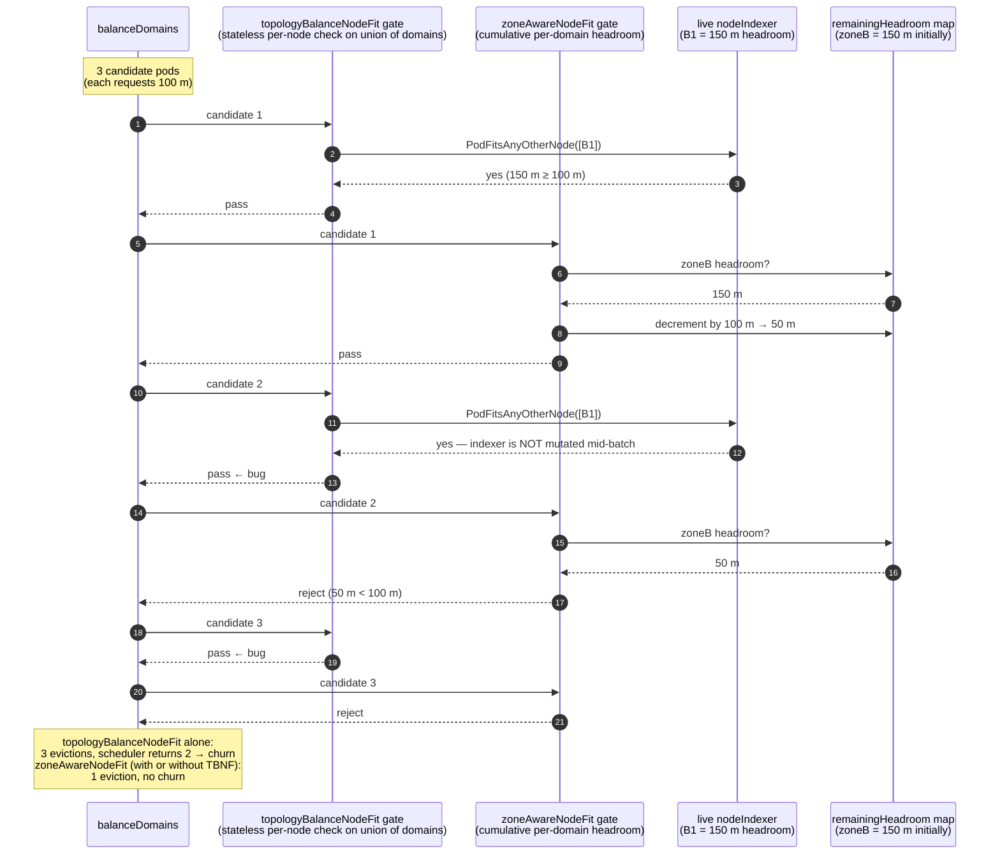

# RFC: ZoneAwareNodeFit for RemovePodsViolatingTopologySpreadConstraint

**Status:** Implementable
**Author:** bruno.chauvet@rokt.com
**Date:** 2026-04-15 (revised 2026-05-17)
**Related issues:** kubernetes-sigs/descheduler#1534, kubernetes-sigs/descheduler#1067

---

## Problem

`RemovePodsViolatingTopologySpreadConstraint` evicts pods from over-loaded topology
domains in batches: each iteration of `balanceDomains` selects N candidate pods from
an over-loaded domain and lets the scheduler place them in under-loaded domains. The
existing `TopologyBalanceNodeFit` gate (default `true`) checks, for each candidate,
whether the pod can fit on at least one node in the union of all under-loaded domains.

The check is **stateless across the batch**: every candidate evaluates `PodFitsAnyOtherNode`
against the same node-view (the descheduler does not simulate intermediate scheduler
decisions). So if N candidates each individually fit on a node in the only under-loaded
domain `B`, all N pass the gate — even though `B` may only have aggregate room for
K ≪ N of them. After eviction, the scheduler can place only K pods in `B`; the
remaining N − K either go back to the over-loaded domain (churn — issues #1534, #1067)
or remain Pending.

### Illustrative scenario

```
Domain A (over-loaded): 7 pods on nodes with ample CPU
Domain B (under-loaded by pod count): 1 pod on a node with 250 m CPU allocatable
Existing pod in B uses 100 m → 150 m of aggregate headroom remains in domain B
Candidate pods request 100 m CPU each

balanceDomains schedules 3 evictions toward domain B.
TopologyBalanceNodeFit evaluates each candidate against the live indexer state
(B1 still has 150 m headroom) → all 3 pass → all 3 evicted.
The scheduler can fit at most 1 of them in B. The other 2 go back to A → churn.
```

### Stateless vs cumulative checks, side-by-side



The fundamental gap: `TopologyBalanceNodeFit` reasons about **per-node fit on the
union of under-loaded domains**, which mathematically collapses to
`OR(merge(domains))`. It cannot detect cumulative over-commit of a single under-loaded
domain because it never tracks state across the batch.

## Proposed Change

Add an opt-in field `ZoneAwareNodeFit *bool` to
`RemovePodsViolatingTopologySpreadConstraintArgs` (default `false`).

When enabled, `balanceDomains` tracks, **per under-loaded topology domain**, the
aggregate resource headroom remaining for the current batch. Each candidate pod is
admitted only if some specific under-loaded domain has both:

- (a) at least one node where the pod fits per the scheduler's per-node predicates
  (`PodFitsAnyOtherNode`), AND
- (b) sufficient remaining aggregate headroom — after subtracting all pods already
  committed to that domain in this batch — to absorb the pod's resource request and
  one pod slot.

On admission, that domain's headroom is decremented. Subsequent candidates see the
decremented state; once a domain is drained, later candidates must find another
qualifying domain or be skipped.

Per-domain headroom is initialised as `sum(allocatable) − sum(existing pod requests)`
across the domain's nodes, for cpu, memory, and pod count.

### Why this is qualitatively different from `TopologyBalanceNodeFit`

The accumulator makes pod-N's decision depend on commitments 1..N-1. There is no
equivalent stateless `OR(merge(...))` formulation, because `PodFitsAnyOtherNode` has
no notion of "headroom remaining after prior commitments in this batch."

`ZoneAwareNodeFit` is therefore **strictly stricter** than `TopologyBalanceNodeFit`:
any pod that fails `ZoneAwareNodeFit` also fails the cumulative-correctness goal
that `TopologyBalanceNodeFit` cannot express.

## API

```yaml
apiVersion: "descheduler/v1alpha2"
kind: DeschedulerPolicy
profiles:
  - name: default
    plugins:
      balance:
        enabled:
          - name: RemovePodsViolatingTopologySpreadConstraint
    pluginConfig:
      - name: RemovePodsViolatingTopologySpreadConstraint
        args:
          topologyBalanceNodeFit: true   # unchanged — existing flag
          zoneAwareNodeFit: true         # NEW — cumulative per-domain gate
```

### Field semantics

| Field | Default | Reasoning level | Catches cumulative over-commit? |
|---|---|---|---|
| `topologyBalanceNodeFit` | `true` | Per-node, stateless across batch | No |
| `zoneAwareNodeFit` | `false` | Per-domain, cumulative within batch | Yes |

Enabling both is valid: `TopologyBalanceNodeFit` runs first as a fast per-node pre-filter,
then `ZoneAwareNodeFit` applies the cumulative-headroom constraint.

## Implementation

### types.go

```go
// ZoneAwareNodeFit, if set to true, requires that each pod evicted by topology-spread
// balancing have, in at least one specific under-loaded topology domain (as identified
// by the constraint's TopologyKey), (a) a node where the pod fits per the scheduler's
// per-node predicates AND (b) sufficient remaining aggregate resource headroom — after
// accounting for other pods already committed to that domain during the same balancing
// round — to absorb the pod.
ZoneAwareNodeFit *bool `json:"zoneAwareNodeFit,omitempty"`
```

### defaults.go

```go
if args.ZoneAwareNodeFit == nil {
    args.ZoneAwareNodeFit = utilptr.To(false)
}
```

### topologyspreadconstraint.go

Two new helpers replace the original duplicate filter + naive OR(OR) check:

```go
// groupNodesByDomain classifies the supplied nodes (already filtered to under-loaded
// domains) by their topology-key label value. Single pass over the same node slice
// the existing filterNodesBelowIdealAvg returns.
func groupNodesByDomain(nodes []*v1.Node, topologyKey string) map[string][]*v1.Node

// computeDomainHeadroom returns, per under-loaded domain, the aggregate remaining
// resource headroom (allocatable − already-requested) summed across the domain's
// nodes. Tracks cpu, memory, and pod count. Computed once per balanceDomains call.
func computeDomainHeadroom(
    nodesByDomain map[string][]*v1.Node,
    nodeIndexer podutil.GetPodsAssignedToNodeFunc,
) map[string]v1.ResourceList

// podFitsSomeDomainWithHeadroom returns the topology-domain key whose remaining
// headroom AND per-node fit both admit pod. On success it decrements that domain's
// headroom in place and returns ok=true. Iterates domains in sorted order for
// determinism.
func podFitsSomeDomainWithHeadroom(
    nodeIndexer podutil.GetPodsAssignedToNodeFunc,
    pod *v1.Pod,
    nodesByDomain map[string][]*v1.Node,
    remainingHeadroom map[string]v1.ResourceList,
) (string, bool)
```

In `balanceDomains`:

```go
zoneAwareNodeFit := utilptr.Deref(d.args.ZoneAwareNodeFit, false)
var nodesByDomain map[string][]*v1.Node
var remainingHeadroom map[string]v1.ResourceList
if zoneAwareNodeFit {
    nodesByDomain = groupNodesByDomain(nodesBelowIdealAvg, tsc.TopologyKey)
    remainingHeadroom = computeDomainHeadroom(nodesByDomain, getPodsAssignedToNode)
}
```

Inside the per-pod loop, after the existing `topologyBalanceNodeFit` gate:

```go
if zoneAwareNodeFit {
    if _, ok := podFitsSomeDomainWithHeadroom(
        getPodsAssignedToNode, aboveToEvict[k], nodesByDomain, remainingHeadroom,
    ); !ok {
        d.logger.V(2).Info(
            "ignoring pod for eviction: no target topology domain has fit + remaining headroom",
            "pod", klog.KObj(aboveToEvict[k]),
        )
        continue
    }
}
```

## Alternatives Considered

**Modify `TopologyBalanceNodeFit` semantics to be cumulative.** Silent behavioural change
for existing users. Rejected.

**Per-node-fit-only gate, no headroom tracking.** This is what the first revision of this
proposal shipped; review surfaced that it collapses to `OR(merge(domains))` and adds
nothing over `TopologyBalanceNodeFit`. Rejected — see Problem section.

**Threading zone context through `EvictorPlugin.PreEvictionFilter`.** Breaking API change
across all plugins. Rejected in favour of a TSC-local gate.

## Test Plan

The acceptance bar for this test plan: each behavioural case must produce a different
result under the redesign than under a naive `OR(merge(domains))` per-node-fit
implementation. Cases marked **gap-catching** would have flagged the prior revision's
churn bug. Cases marked **regression** ensure the new gate still enforces existing
invariants (per-node fit, default-off no-op).

### Integration cases (`TestTopologySpreadConstraint` table)

Shared topology unless noted: `zoneA` over-loaded (7 pods on a 2 000 m node);
`zoneB` under-loaded (1 pod on a 250 m node → 150 m aggregate headroom).
Each candidate pod requests 100 m CPU. balanceDomains schedules 3 evictions.

| # | Scenario | Args | Expected | Catches gap? |
|---|---|---|---|---|
| 1 | ZoneAwareNodeFit caps cumulative load **on top of** TopologyBalanceNodeFit | TBNF=true (default), ZANF=true, evictor nodeFit=false | 1 of 3 | ✅ — prior impl admits 3 (per-node check stateless across batch) |
| 2 | ZoneAwareNodeFit alone caps at aggregate headroom | TBNF=false, ZANF=true, evictor nodeFit=false | 1 of 3 | ✅ — prior impl admits 3 |
| 3 | TopologyBalanceNodeFit alone does **not** cap cumulative load (the bug) | defaults (TBNF=true, ZANF=false), nodeFit=false | 3 of 3 | ❌ baseline contrast (proves the bug exists without the new gate) |
| 4 | Drains domain by domain, caps at sum of headroom across domains (zoneB=150 m, zoneC=250 m → total headroom 400 m fits 4×100 m, but algorithm schedules 4 evictions in 2 iterations; the 4th finds both domains drained) | TBNF=false, ZANF=true, nodeFit=false | 3 of 4 | ✅ — prior impl admits 4 (zoneC always has per-node fit) |
| 5 | Per-node fit still required when aggregate headroom is misleadingly high (zoneB has 5 × 50 m nodes = 250 m aggregate but no single node fits 100 m) | TBNF=false, ZANF=true, nodeFit=false | 0 evictions | ❌ regression — both impls reject |
| 6 | Default off — backward compat (ZANF unset, evictor nodeFit handles it) | defaults, nodeFit=true | 0 evictions | ❌ regression — identical to prior versions |

### Helper unit tests

| Test | Coverage |
|---|---|
| `TestGroupNodesByDomain` | Classifies by `node.Labels[topologyKey]`; drops nodes missing the label |
| `TestComputeDomainHeadroom` | Aggregates allocatable − sum-of-requests across a domain's nodes; counts cpu (millicores) and pod slots correctly |
| `TestPodFitsSomeDomainWithHeadroom` — alphabetical commit | Inserts `zoneB` first into the map, asserts commit lands on `zoneA` (deterministic sorted iteration) |
| `TestPodFitsSomeDomainWithHeadroom` — drain then reject | Three sequential calls with starting headroom = 250 m; first two admit, third rejects (50 m < 100 m) |
| `TestPodFitsSomeDomainWithHeadroom` — aggregate failure | Headroom < pod request → reject |
| `TestPodFitsSomeDomainWithHeadroom` — per-node failure | Aggregate ample but no single node fits (occupant pod consumes capacity) → reject |
| `TestPodFitsSomeDomainWithHeadroom` — empty input | Empty `nodesByDomain` → reject without error |

## Risk

**Low.**
- Opt-in (`false` by default).
- Additive: existing `TopologyBalanceNodeFit` is unchanged.
- Localised to `balanceDomains` and a few new helpers in the TSC plugin.
- No changes to framework types, eviction API, or other plugins.
