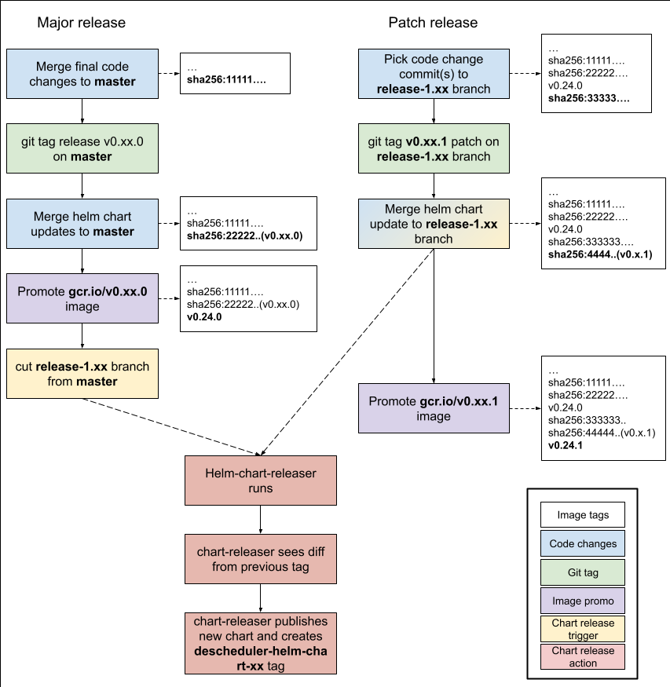

# Release Guide

The process for publishing each Descheduler release includes a mixture of manual and automatic steps. Over 
time, it would be good to automate as much of this process as possible. However, due to current limitations there 
is care that must be taken to perform each manual step precisely so that the automated steps execute properly.

## Pre-release Code Changes

Before publishing each release, the following code updates must be made:

- [ ] (Optional, but recommended) Bump `k8s.io` dependencies to the `-rc` tags. These tags are usually published around upstream code freeze. [Example](https://github.com/kubernetes-sigs/descheduler/pull/539)
- [ ] Bump `k8s.io` dependencies to GA tags once they are published (following the upstream release). [Example](https://github.com/kubernetes-sigs/descheduler/pull/615)
- [ ] Ensure that Go is updated to the same version as upstream. [Example](https://github.com/kubernetes-sigs/descheduler/pull/801)
- [ ] Make CI changes in [github.com/kubernetes/test-infra](https://github.com/kubernetes/test-infra) to add the new version's tests (note, this may also include a Go bump). [Example](https://github.com/kubernetes/test-infra/pull/25833)
- [ ] Update local CI versions for utils (such as golang-ci), kind, and go. [Example - e2e](https://github.com/kubernetes-sigs/descheduler/commit/ac4d576df8831c0c399ee8fff1e85469e90b8c44), [Example - helm](https://github.com/kubernetes-sigs/descheduler/pull/821)
- [ ] Update version references in docs and Readme. [Example](https://github.com/kubernetes-sigs/descheduler/pull/617)

## Release Process

When the above pre-release steps are complete and the release is ready to be cut, perform the following steps **in order** 
(the flowchart below demonstrates these steps):

**Version release**
1. Create the `git tag` on `master` for the release, eg `v0.24.0`
2. Merge Helm chart version update to `master` (see [Helm chart](#helm-chart) below). [Example](https://github.com/kubernetes-sigs/descheduler/pull/709)
3. Perform the [image promotion process](https://github.com/kubernetes/k8s.io/tree/main/k8s.gcr.io#image-promoter). [Example](https://github.com/kubernetes/k8s.io/pull/3344)
4. Cut release branch from `master`, eg `release-1.24`
5. Publish release using Github's release process from the git tag you created
6. Email `kubernetes-sig-scheduling@googlegroups.com` to announce the release

**Patch release**
1. Pick relevant code change commits to the matching release branch, eg `release-1.24`
2. Create the patch tag on the release branch, eg `v0.24.1` on `release-1.24`
3. Merge Helm chart version update to release branch
4. Perform the image promotion process for the patch version
5. Publish release using Github's release process from the git tag you created
6. Email `kubernetes-sig-scheduling@googlegroups.com` to announce the release

### Flowchart



### Image promotion process

Every merge to any branch triggers an [image build and push](https://github.com/kubernetes/test-infra/blob/c36b8e5/config/jobs/image-pushing/k8s-staging-descheduler.yaml) to a `gcr.io` repository. 
These automated image builds are snapshots of the code in place at the time of every PR merge and 
tagged with the latest git SHA at the time of the build. To create a final release image, the desired 
auto-built image SHA is added to a [file upstream](https://github.com/kubernetes/k8s.io/blob/e9e971c/k8s.gcr.io/images/k8s-staging-descheduler/images.yaml) which 
copies that image to a public registry.

Automatic builds can be monitored and re-triggered with the [`post-descheduler-push-images` job](https://prow.k8s.io/?job=post-descheduler-push-images) on prow.k8s.io.

Note that images can also be manually built and pushed using `VERSION=$VERSION make push-all` by [users with access](https://github.com/kubernetes/k8s.io/blob/fbee8f67b70304241e613a672c625ad972998ad7/groups/sig-scheduling/groups.yaml#L33-L43).

## Helm Chart
We currently use the [chart-releaser-action GitHub Action](https://github.com/helm/chart-releaser-action) to automatically 
publish [Helm chart releases](https://github.com/kubernetes-sigs/descheduler/blob/022e07c/.github/workflows/release.yaml). 
This action is triggered when it detects any changes to [`Chart.yaml`](https://github.com/kubernetes-sigs/descheduler/blob/022e07c27853fade6d1304adc0a6ebe02642386c/charts/descheduler/Chart.yaml) on 
a `release-*` branch.

Helm chart releases are managed by a separate set of git tags that are prefixed with `descheduler-helm-chart-*`. Example git tag name is `descheduler-helm-chart-0.18.0`.
Released versions of the helm charts are stored in the `gh-pages` branch of this repo.

The major and minor version of the chart matches the descheduler major and minor versions. For example descheduler helm chart version helm-descheduler-chart-0.18.0 corresponds
to descheduler version v0.18.0. The patch version of the descheduler helm chart and the patcher version of the descheduler will not necessarily match. The patch
version of the descheduler helm chart is used to version changes specific to the helm chart.

1. Merge all helm chart changes into the master branch before the release is tagged/cut
   1. Ensure that `appVersion` in file `charts/descheduler/Chart.yaml` matches the descheduler version(no `v` prefix)
   2. Ensure that `version` in file `charts/descheduler/Chart.yaml` has been incremented. This is the chart version.
2. Make sure your repo is clean by git's standards
3. Follow the release-branch or patch release tagging pattern from the above section.
4. Verify the new helm artifact has been successfully pushed to the `gh-pages` branch

## Notes
The Helm releaser-action compares the changes in the action-triggering branch to the latest tag on that branch, so if you tag before creating the new branch there
will be nothing to compare and it will fail. This is why it's necessary to tag, eg, `v0.24.0` *before* making the changes to the 
Helm chart version, so that there is a new diff for the action to find. (Tagging *after* making the Helm chart changes would 
also work, but then the code that gets built into the promoted image will be tagged as `descheduler-helm-chart-xxx` rather than `v0.xx.0`).

See [post-descheduler-push-images dashboard](https://testgrid.k8s.io/sig-scheduling#post-descheduler-push-images) for staging registry image build job status.

View the descheduler staging registry using [this URL](https://console.cloud.google.com/gcr/images/k8s-staging-descheduler/GLOBAL/descheduler) in a web browser
or use the below `gcloud` commands.

List images in staging registry.
```
gcloud container images list --repository gcr.io/k8s-staging-descheduler
```

List descheduler image tags in the staging registry.
```
gcloud container images list-tags gcr.io/k8s-staging-descheduler/descheduler
```

Get SHA256 hash for a specific image in the staging registry.
```
gcloud container images describe gcr.io/k8s-staging-descheduler/descheduler:v20200206-0.9.0-94-ge2a23f284
```

Pull image from the staging registry.
```
docker pull gcr.io/k8s-staging-descheduler/descheduler:v20200206-0.9.0-94-ge2a23f284
```
