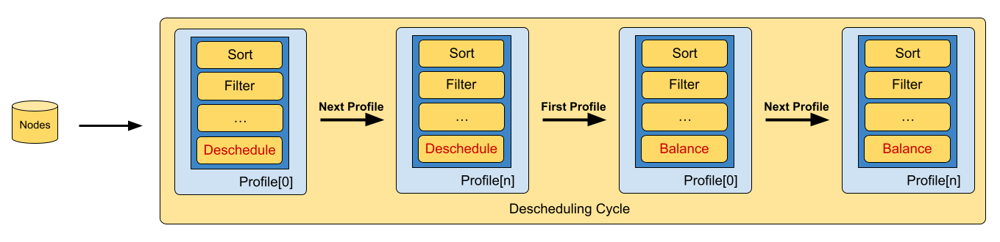

<!--
**Note:** When your KEP is complete, all of these comment blocks should be removed.

To get started with this template:

- [ ] **Pick a hosting SIG.**
  Make sure that the problem space is something the SIG is interested in taking
  up. KEPs should not be checked in without a sponsoring SIG.
- [ ] **Create an issue in kubernetes/enhancements**
  When filing an enhancement tracking issue, please make sure to complete all
  fields in that template. One of the fields asks for a link to the KEP. You
  can leave that blank until this KEP is filed, and then go back to the
  enhancement and add the link.
- [ ] **Make a copy of this template directory.**
  Copy this template into the owning SIG's directory and name it
  `NNNN-short-descriptive-title`, where `NNNN` is the issue number (with no
  leading-zero padding) assigned to your enhancement above.
- [ ] **Fill out as much of the kep.yaml file as you can.**
  At minimum, you should fill in the "Title", "Authors", "Owning-sig",
  "Status", and date-related fields.
- [ ] **Fill out this file as best you can.**
  At minimum, you should fill in the "Summary" and "Motivation" sections.
  These should be easy if you've preflighted the idea of the KEP with the
  appropriate SIG(s).
- [ ] **Create a PR for this KEP.**
  Assign it to people in the SIG who are sponsoring this process.
- [ ] **Merge early and iterate.**
  Avoid getting hung up on specific details and instead aim to get the goals of
  the KEP clarified and merged quickly. The best way to do this is to just
  start with the high-level sections and fill out details incrementally in
  subsequent PRs.

Just because a KEP is merged does not mean it is complete or approved. Any KEP
marked as `provisional` is a working document and subject to change. You can
denote sections that are under active debate as follows:

```
<<[UNRESOLVED optional short context or usernames ]>>
Stuff that is being argued.
<<[/UNRESOLVED]>>
```

When editing KEPS, aim for tightly-scoped, single-topic PRs to keep discussions
focused. If you disagree with what is already in a document, open a new PR
with suggested changes.

One KEP corresponds to one "feature" or "enhancement" for its whole lifecycle.
You do not need a new KEP to move from beta to GA, for example. If
new details emerge that belong in the KEP, edit the KEP. Once a feature has become
"implemented", major changes should get new KEPs.

The canonical place for the latest set of instructions (and the likely source
of this file) is [here](/keps/NNNN-kep-template/README.md).

**Note:** Any PRs to move a KEP to `implementable`, or significant changes once
it is marked `implementable`, must be approved by each of the KEP approvers.
If none of those approvers are still appropriate, then changes to that list
should be approved by the remaining approvers and/or the owning SIG (or
SIG Architecture for cross-cutting KEPs).
-->
# KEP-753: Descheduling framework

<!--
This is the title of your KEP. Keep it short, simple, and descriptive. A good
title can help communicate what the KEP is and should be considered as part of
any review.
-->

<!--
A table of contents is helpful for quickly jumping to sections of a KEP and for
highlighting any additional information provided beyond the standard KEP
template.

Ensure the TOC is wrapped with
  <code>&lt;!-- toc --&rt;&lt;!-- /toc --&rt;</code>
tags, and then generate with `hack/update-toc.sh`.
-->

<!-- toc -->
- [Release Signoff Checklist](#release-signoff-checklist)
- [Summary](#summary)
- [Motivation](#motivation)
  - [Goals](#goals)
  - [Non-Goals](#non-goals)
- [Proposal](#proposal)
  - [User Stories (Optional)](#user-stories-optional)
    - [Story 1](#story-1)
    - [Story 2](#story-2)
  - [Notes/Constraints/Caveats (Optional)](#notesconstraintscaveats-optional)
  - [Risks and Mitigations](#risks-and-mitigations)
- [Design Details](#design-details)
  - [Test Plan](#test-plan)
      - [Prerequisite testing updates](#prerequisite-testing-updates)
      - [Unit tests](#unit-tests)
      - [Integration tests](#integration-tests)
      - [e2e tests](#e2e-tests)
  - [Graduation Criteria](#graduation-criteria)
  - [Upgrade / Downgrade Strategy](#upgrade--downgrade-strategy)
  - [Version Skew Strategy](#version-skew-strategy)
- [Production Readiness Review Questionnaire](#production-readiness-review-questionnaire)
  - [Feature Enablement and Rollback](#feature-enablement-and-rollback)
  - [Rollout, Upgrade and Rollback Planning](#rollout-upgrade-and-rollback-planning)
  - [Monitoring Requirements](#monitoring-requirements)
  - [Dependencies](#dependencies)
  - [Scalability](#scalability)
  - [Troubleshooting](#troubleshooting)
- [Implementation History](#implementation-history)
- [Drawbacks](#drawbacks)
- [Alternatives](#alternatives)
- [Infrastructure Needed (Optional)](#infrastructure-needed-optional)
<!-- /toc -->

## Release Signoff Checklist

<!--
**ACTION REQUIRED:** In order to merge code into a release, there must be an
issue in [kubernetes/enhancements] referencing this KEP and targeting a release
milestone **before the [Enhancement Freeze](https://git.k8s.io/sig-release/releases)
of the targeted release**.

For enhancements that make changes to code or processes/procedures in core
Kubernetes—i.e., [kubernetes/kubernetes], we require the following Release
Signoff checklist to be completed.

Check these off as they are completed for the Release Team to track. These
checklist items _must_ be updated for the enhancement to be released.
-->

Items marked with (R) are required *prior to targeting to a milestone / release*.

- [ ] (R) Enhancement issue in release milestone, which links to KEP dir in [kubernetes/enhancements] (not the initial KEP PR)
- [ ] (R) KEP approvers have approved the KEP status as `implementable`
- [ ] (R) Design details are appropriately documented
- [ ] (R) Test plan is in place, giving consideration to SIG Architecture and SIG Testing input (including test refactors)
  - [ ] e2e Tests for all Beta API Operations (endpoints)
  - [ ] (R) Ensure GA e2e tests meet requirements for [Conformance Tests](https://github.com/kubernetes/community/blob/master/contributors/devel/sig-architecture/conformance-tests.md)
  - [ ] (R) Minimum Two Week Window for GA e2e tests to prove flake free
- [ ] (R) Graduation criteria is in place
  - [ ] (R) [all GA Endpoints](https://github.com/kubernetes/community/pull/1806) must be hit by [Conformance Tests](https://github.com/kubernetes/community/blob/master/contributors/devel/sig-architecture/conformance-tests.md)
- [ ] (R) Production readiness review completed
- [ ] (R) Production readiness review approved
- [ ] "Implementation History" section is up-to-date for milestone
- [ ] User-facing documentation has been created in [kubernetes/website], for publication to [kubernetes.io]
- [ ] Supporting documentation—e.g., additional design documents, links to mailing list discussions/SIG meetings, relevant PRs/issues, release notes

<!--
**Note:** This checklist is iterative and should be reviewed and updated every time this enhancement is being considered for a milestone.
-->

[kubernetes.io]: https://kubernetes.io/
[kubernetes/enhancements]: https://git.k8s.io/enhancements
[kubernetes/kubernetes]: https://git.k8s.io/kubernetes
[kubernetes/website]: https://git.k8s.io/website

## Summary

<!--
This section is incredibly important for producing high-quality, user-focused
documentation such as release notes or a development roadmap. It should be
possible to collect this information before implementation begins, in order to
avoid requiring implementors to split their attention between writing release
notes and implementing the feature itself. KEP editors and SIG Docs
should help to ensure that the tone and content of the `Summary` section is
useful for a wide audience.

A good summary is probably at least a paragraph in length.

Both in this section and below, follow the guidelines of the [documentation
style guide]. In particular, wrap lines to a reasonable length, to make it
easier for reviewers to cite specific portions, and to minimize diff churn on
updates.

[documentation style guide]: https://github.com/kubernetes/community/blob/master/contributors/guide/style-guide.md
-->

Over the past few years, the Descheduler project has grown considerably both in adoption and contributions. A big part of that growth has been the feature requests of active users. This has helped make it a suitable production option for complex pod eviction logic. This growth has come with regular requests for new features in the Descheduler. The general approach we have taken to addressing new features has usually been to accept and implement any that weren’t strongly opposed. This has led to some excellent improvements in the Descheduler. In fact, this approach has served as the de facto project roadmap as almost every new feature in recent years has been the direct result of a specific user request.

However, this growth method has started to create some problems that now constrain future growth. Specifically, many new features require additional API updates that expand and contrive the existing API while also adding new maintenance demands. And in some cases, existing features are built with default assumptions that conflict with new features, blocking those new feature requests from progressing (without breaking API or behavior changes). While the Descheduler config API is currently `alpha`, meaning we do technically have the ability to make breaking changes without warning, we have tried not to do this. This is because part of developing the Descheduler’s growth has been to operate within the support constraints of a graduated API (eg, not breaking current defaults) in order to build user trust and establish known use cases for the Descheduler. This feeds toward the end objective of eventually graduating to a stable user-facing API. As such, these two aspects of the Descheduler project (open acceptance of individual features and stable API support) are reaching a point where their coexistence is causing growing pains for the project.

In addition, the rate at which feature requests (and bug reports) are created outpaces the ability of the active project maintainers to keep up with them. And while many new features are ultimately implemented by the person requesting them (even if they are not actively involved in the Descheduler project), the ownership (and upkeep) of these features eventually fall to the project maintainers. Unfortunately, the ability of the Descheduler maintainers to keep up with new features has not scaled as much as the growth of the project.

## Motivation

<!--
This section is for explicitly listing the motivation, goals, and non-goals of
this KEP.  Describe why the change is important and the benefits to users. The
motivation section can optionally provide links to [experience reports] to
demonstrate the interest in a KEP within the wider Kubernetes community.

[experience reports]: https://github.com/golang/go/wiki/ExperienceReports
-->

The goal of this proposal is first and foremost to position the Descheduler as a project that is ready to graduate to a stable definition. The current Descheduler project has served well as a proof-of-concept for the adoption of various qualities in production environments. Now, it is time to take what has been learned and apply it toward building a stable eviction logic platform that can be more widely used and trusted.

We are proposing a collaborative effort to fundamentally redefine the purpose of the Descheduler GitHub repository (and ostensibly, the Descheduler project itself) from that of a centralized “component” to a developer-facing, importable “library”, which we will refer to as the Descheduling Framework. Conceptually, this idea borrows heavily from the Scheduler Framework. But from a technical implementation standpoint, there will likely be many differences between the two frameworks.

### Goals

<!--
List the specific goals of the KEP. What is it trying to achieve? How will we
know that this has succeeded?
-->

* **Focus on the platform**: Consolidate maintainer effort on building a stable platform for writing custom pod eviction logic.
* **API Stability**: Enable third-party developers to implement custom, unique edge-case features without concern for breaking existing behavior that other users may depend on.
* **Enable external development**: Decentralize Descheduler feature development to empower broader diversity of features available to users.
* **Promote ownership of strategies**: Improve feature maintenance by allowing third-party providers to specialize and own their own features, rather than defaulting ownership to the Descheduler maintainers (as is the current case once a new feature merges). The developers of these features know them best, and they deserve full ownership and responsibility for maintaining them.
* **Elevate feature divergence**: Remove the role of “feature gatekeeper” from the Descheduler maintainers to promote a flourishing ecosystem of use cases.

### Non-Goals

<!--
What is out of scope for this KEP? Listing non-goals helps to focus discussion
and make progress.
-->

- Break any existing use cases of the Descheduler. We have striven for reliable feature support within the Kubernetes deprecation policies, and it is important not to change that. This refactor should not affect any existing workflows of the Descheduler (including published Descheduler images)

## Proposal

<!--
This is where we get down to the specifics of what the proposal actually is.
This should have enough detail that reviewers can understand exactly what
you're proposing, but should not include things like API designs or
implementation. What is the desired outcome and how do we measure success?.
The "Design Details" section below is for the real
nitty-gritty.
-->

### User Stories (Optional)

<!--
Detail the things that people will be able to do if this KEP is implemented.
Include as much detail as possible so that people can understand the "how" of
the system. The goal here is to make this feel real for users without getting
bogged down.
-->

#### Story 1

As a descheduler project maintainer I'd like to move maintenance of individual strategies outside the project to strategy owners. So I can focus on the core features of the project by promoting existing functionality to stable and integrating popular enhancements.

Some of the currently suggested enhancements:

**Event-triggered Evictions**

Relevant links:
- https://github.com/kubernetes-sigs/descheduler/pull/488
- https://github.com/kubernetes-sigs/descheduler/issues/696

The Descheduler currently runs on a periodic interval, evicting Pods regularly either as a long-lived Deployment or CronJob. However, the effectiveness of these evictions could be optimized by being more reactive to cluster changes. Triggering evictions based on cluster events is the solution that has been proposed for this. Going hand-in-hand with custom Strategies, this ability will need to be exposed to developers in order to tailor this to their own use cases.

**Custom Pod Eviction Logic**

Relevant links:
- https://github.com/kubernetes-sigs/descheduler/issues/690
- https://github.com/kubernetes-sigs/descheduler/pull/724

The Descheduler provides Strategies as the main feature-level logic for eviction algorithms. But it also defines internal types like the [PodEvictor](https://github.com/kubernetes-sigs/descheduler/blob/224e2b0/pkg/descheduler/evictions/evictions.go#L51-L65), [PodLister](https://github.com/kubernetes-sigs/descheduler/blob/224e2b078f62e3537d32caec7733f0918d48c248/pkg/descheduler/pod/pods.go#L165-L175), and [NodeLister](https://github.com/kubernetes-sigs/descheduler/blob/224e2b078f62e3537d32caec7733f0918d48c248/pkg/descheduler/node/node.go#L33) that control additional filtering and sorting of the Kubernetes resources relevant to the Descheduler (namely, Pods and Nodes). These could be extended with custom logic, or even be abstracted to support listing and indexing any generic resource, to provide further fine-grained customization of eviction algorithms. For example, there is a proposal to control Pod eviction [based on availability of PVCs](https://github.com/kubernetes-sigs/descheduler/pull/723) on the node.

**Extending the Config API**

Relevant links:
- https://github.com/kubernetes-sigs/descheduler/pull/587
- https://github.com/kubernetes-sigs/descheduler/issues/486

Any custom features that third-party developers implement will also likely require custom configuration options in the [Descheduler API](https://github.com/kubernetes-sigs/descheduler/blob/1529180/pkg/api/types.go). However, the current API is strictly defined and inflexible to changes without growing significantly or breaking current use cases. Therefore, we need to redesign the API in a way that is extensible for generic additions while maintaining stability.

**Existing Code**

Some of these have already been designed with future customizability in mind. For example, the PodLister accepts a [Filter function](https://github.com/kubernetes-sigs/descheduler/blob/224e2b078f62e3537d32caec7733f0918d48c248/pkg/descheduler/pod/pods.go#L168) and the generic [Strategy function signature](https://github.com/kubernetes-sigs/descheduler/blob/224e2b078f62e3537d32caec7733f0918d48c248/pkg/descheduler/descheduler.go#L81) used by all Strategies has been standardized to enable a [pseudo-registry](https://github.com/kubernetes-sigs/descheduler/blob/224e2b078f62e3537d32caec7733f0918d48c248/pkg/descheduler/descheduler.go#L178-L189) (similar to how the Scheduler builds a [registry of Plugin functions](https://github.com/kubernetes/kubernetes/blob/1d656d46a2b87898e7c3449be37de1ac925ccb9c/pkg/scheduler/framework/runtime/registry.go#L67-L70)). These patterns can be used as a template to expand this to the rest of the codebase.

Together, each of these use cases present examples of a customization point for developers. For example, a user wishing to design a custom Strategy may need to add additional config options to the API with eviction priority given to certain pods based on the type of workload that pod is running.


#### Story 2

As a descheduler user I'd like to extend the descheduler with custom strategies that conforms to my company policies or fits my company security countermeasures.

Currently suggested enhancement:

**Custom "Out-of-tree" Strategies**

Relevant links:
- https://github.com/kubernetes-sigs/descheduler/issues/557
- https://github.com/kubernetes-sigs/descheduler/issues/679
- https://github.com/kubernetes-sigs/descheduler/issues/586
- https://github.com/kubernetes-sigs/descheduler/pull/706

Perhaps the most prominent entry point for customizing the Descheduler is the development of custom Strategies. Strategies define individual eviction algorithms at the feature level. The Descheduler currently provides a set of default Strategies that fit many use cases (for example, RemovePodsViolatingNodeTaints). But, with growing unique production use cases, users may need to implement behavior (or modify existing behavior) in a way that is incompatible with current code or too unique to support at a project level. Enabling the development of custom Strategies is the conceptual equivalent of out-of-tree Plugins in the Scheduler Framework.


### Notes/Constraints/Caveats (Optional)

<!--
Na co dat pozor?
What are the caveats to the proposal?
What are some important details that didn't come across above?
Go in to as much detail as necessary here.
This might be a good place to talk about core concepts and how they relate.
-->

- **API boundaries**: It's non-trivial to properly set the API for the new plugins. Each custom plugin may have different expectations about what functionality is provided by the framework. From providing various informers (pods, nodes, etc.) to exposing eviction or sorting logic which can be exposed through a custom plugin. Currently, every strategy is responsible for invoking the eviction explicitly. Some strategies have their own sorting mechanism which could be shared by other strategies. Some strategies are implemented in a way that allows to replace their current sorting mechanism by any reasonable ordering. E.g. time based, annotation based, replicaset size, etc.
- **Framework plugin API**: The first iteration of the plugin API will be reduced to provide minimal interface for the currently existing strategies. Later, it can evolve and be extended with new extension points (to accommodate for new functionalities that can be shared across plugins) or additional "common" routines simplyfing plugin creation.
- **Workload distribution awareness**: Some strategies take into account other pods when selecting victims for eviction. Other strategies aim for balancing pods across nodes. Incorrect order of executing strategies might work towards the expected goal of descheduling. Thus, it's important to allow users to change the ordering. Also, with any ordering it's important to first run all plugins that work against even balancing.
- **Simulation**: The framework needs to allow to simulate its decisions so users can run it in a non-destructive way to either tune the descheduler configuration to improve performance or to detect how much a cluster deviated from expected scheduling constraints. Posing a challenge for custom plugins creators to be aware of this requirement. E.g. to avoid building their own clientsets from scratch that are expected to be injected by the framework. So the framework can inject a fake clientset instead when a simulation is performed.
- **Descheduling policy and plugin configuration**: Each plugin will have its own list of arguments whose data types are unknown in advance. Thus the overall descheduling policy configuration needs to use a "variable" data type for each plugin configuration. Making the whole policy validation and conversion more challenging.
- **Framework internal counters**: The framework needs to keep count of how many pods (in general, per namespace, per node, etc.) were evicted through various plugins. Plugins are expected to evict pods through an abstracted interface injected by the framework. Which (if configured) will limit the number of pods evicted. At the same time setting various metrics.
- **Pods as cattle**: The descheduler treats all the pods the same. If a pod fails to be evicted, another one is retried. There's no guaranteed order of eviction. Some strategies sort pods based on a priority or other ordering that's specific to a decision making logic.
- **Stateless**: The descheduler is currently designed to be stateless. It does not keep track of pods evicted in a previous descheduling cycle. Neither a list of pods that failed to be evicted.
- **Plugins invoking other plugins**: A descheduling plugin logic may invoke routines of other plugins. Each plugin is injected with a shared interface allowing for runtime configuration of sorting or filtering policies customizable through a descheduling policy configuration.

### Risks and Mitigations

<!--
What are the risks of this proposal, and how do we mitigate? Think broadly.
For example, consider both security and how this will impact the larger
Kubernetes ecosystem.

How will security be reviewed, and by whom?

How will UX be reviewed, and by whom?

Consider including folks who also work outside the SIG or subproject.
-->

- **Plugins whereabouts**: It's currently unclear where all the new community accepted plugins will live.
- **Limited plugin API**: The existing plugin API might be too limiting for plugin creators. Any such limitation will be discussed through community channels and addressed accordingly.
- **New default plugins acceptance**: The descheduler will strive for reducing acceptance of new default plugins. All new plugins will be external and users will be asked to assembly their own deschedulers whenever the default set is insufficient.
- **Framework in the core**: The descheduler project maintainers will shift their focus from plugins to the framework. Closely collaborating with plugin owners to implement missing functionalities in the framework and adjusting to new ecosystem requirements.
- **Framework stability**: The framework is expected to be a central piece for combining various descheduling policies based on user use cases. Once the framework matures and provides a solid base the amount of new features will be slowly reduced to minimum. Instead, wrapping new functionalities into plugins.
- **Plugins invoking other plugins**: In order to share sorting, filtering and other shared mechanisms across plugins, each plugin needs to be allowed to transparently invoke these mechanisms through a shared interface. When or whether either of the shared mechanisms get invoke is plugin dependent. Posing a risk that some plugins might successfully ignore user configured preferences.

## Design Details

<!--
This section should contain enough information that the specifics of your
change are understandable. This may include API specs (though not always
required) or even code snippets. If there's any ambiguity about HOW your
proposal will be implemented, this is the place to discuss them.
-->


The framework provides basic handles for plugins, their registration, mechanics for running strategies within descheduling cycles and connects all the pieces together. Provides registry with default plugins and ability to extend it with out-of-tree plugins. Plugins are initialized with the provided configuration before the descheduling workflow starts.

### Plugins

A plugin is an encapsulation of a descheduling decision making policy. Alongside with one or more extension points. Each extension point responsible for a single action. Some of the actions may invoke other actions (such as sorting or filtering). Currently recognized extension points are:

- **PreSort**: sort pods before processing
- **Deschedule**: evict pods by processing each pod independently of each other
- **Balance**: balance distribution of pods while taking two or more pods into account
- **Filter**: provides means for filtering pods before they are evicted (i.e. responsible for deciding when a pod can be evicted)
- **Sort**: sort pods before eviction

The current descheduler strategies can be mapped to the corresponding extension points in the following manner:

- **Deschedule**: RemoveFailedPods, RemovePodsViolatingNodeAffinity, RemovePodsViolatingNodeTaints, RemovePodsViolatingInterPodAntiAffinity, RemovePodsViolatingInterPodAntiAffinity, RemovePodsHavingTooManyRestarts
- **Balance**: RemoveDuplicatePods, RemovePodsViolatingTopologySpreadConstraint, LowNodeUtilization, HighNodeUtilization

The Filter extension point corresponds to the current `IsEvictable` of the `PodEvictor` data type. The Sort extension point corresponds to sorting pods by priority from low to high.

The extension points are divided into two categories:

- High level: Deschedule and Balance (eviction strategy implementation)
- Low level: PreSort, Filter, Sort

High level extension points are invoked by the descheduling framework. The low level ones are invoked inside high level extension points. It is solely up to each strategy implementation to decide at which point the low level extension points get invoked. Invocation of all low level extension points is optional. This shifts the responsibility of invoking the shared routines (configured through the descheduling policy) to plugin owners. Increasing emphasis on awareness of this limitation.

The plugin configuration API is expected to allow plugins to be disabled, resp. enabled in order to change the descheduling behavior. Each plugin is passed its configuration arguments and a handle with a clientset, pod evictor, pod filter, sorter and other utilities. Plugins are expected to be initialized through the following constructor:

```go
func New(args runtime.Object, handle framework.Handle) (framework.Plugin, error) {
	pluginArgs, ok := args.(*framework.PluginArgs)
	…
}
```

### Extension points

An extension point is the lowest level action a plugin can perform. Ranging from sorting a list of pods into nominating candidates for eviction followed by their actual eviction through shared interface. Extension points allow for implementation of a custom code logic that can be enabled based on individual use case requirements.

All plugins are expected to implement the following `Plugin` interface. It serves as a basic data type for storing the plugins into a plugin registry.

```go
type Plugin interface {
	Name() string
}
```

Any plugin can implement either of the following interfaces:

- `PreSortPlugin`: by every sorting mechanism that’s expected to sort pods before processing by individual eviction strategies. E.g. to process the oldest pods first.
  ```go
  type PreSortPlugin interface {
  	Plugin
  	PreLess(*v1.Pod, *v1.Pod) bool
  }
  ```

- `DeschedulePlugin`, `BalancePlugin`: all eviction strategies are expected to implement at least one of these.
  ```go
  type DeschedulePlugin interface {
  	Plugin
  	Deschedule(ctx context.Context, nodes []*v1.Node) *Status
  }

  type BalancePlugin interface {
  	Plugin
  	Balance(ctx context.Context, nodes []*v1.Node) *Status
  }
  ```

- `EvictPlugin`: any filtering mechanism that wants to filter out pods before eviction. E.g. avoid evicting pods with local storage.
  ```go
  type EvictPlugin interface {
  	Plugin
  	Filter(*v1.Pod) bool
  }
  ```

- `SortPlugin`: any sorting mechanism that wants to sort pods right before the eviction. E.g. any pod eviction can be throttled so it might be more efficient to evict low priority pods first.
  ```go
  type SortPlugin interface {
  	Plugin
  	Less(*v1.Pod, *v1.Pod) bool
  }
  ```

### Descheduling cycle

Some eviction strategies like PodLifeTime or RemovePodsHavingTooManyRestarts evict pods while ignoring everything else around (nodes, pods). Given the simplicity, filtering and sorting can be done at any point. Other eviction strategies like RemovePodsViolatingInterPodAntiAffinity or RemovePodsViolatingTopologySpreadConstraint need to take other pods or nodes into account when deciding whether a pod gets evicted. In some cases performing pod filtering (e.g. excluding inevictable pods) may be carried in the middle of a strategy implementation. To avoid limiting the strategies while allowing the filtering and sorting implementation to be plugable, the strategies need to be allowed to access certain extension points internally. Thus, the descheduling cycle reduces to invocation of only two extension points (run in the following order):

- Run all Deschedule extension points
- Run all Balance extension points

The Balance extension point is run after the Deschedule. The reversed order might work against balancing. The actual pod filtering before eviction and pod sorting before processing or before eviction are expected to be invoked inside the Deschedule and the Balance extension points. A pod can be evicted at any point. While it is optional, all strategies are recommended to use the shared filtering and sorting to allow users to plug a different implementation which is more aligned with their use cases.

Each descheduling cycle starts by capturing the current state of a cluster. Both Deschedule and Balance extension points are expected to receive the same list of nodes. The order in which individual nodes (and assigned pods) are processed per the mentioned extension points is implementation dependent. Each plugin can traverse the pods in any order, evict any pod at any moment. There's no paralelism of plugins. Only a single plugin is executed at a given time. Each pod nominated for eviction is expected to be evicted as soon as possible.

**Note**: Later implementations might mark pods for eviction instead so other plugins may take this fact into consideration to avoid unnecessary evictions. This will become more relevant when the eviction is replaced by an evacuation request (TODO(ingvagabund): share the KEP link once available) which introduces a delay before a pod is actually evicted.


### Descheduler

The descheduler itself is expected to initialize the framework and invoke the high level framework routines responsible for executing individual plugin extension points. E.g.

```go
func New(...) (*Descheduler, error) {
	...
}

func (d *Descheduler) descheduleOnce(ctx context.Context) error {
	...
	nodes, err := nodeutil.ReadyNodes(ctx, ...)
	if status := d.framework.RunDeschedulePlugins(ctx, nodes); status != nil && status.Err != nil {
		return status.Err
	}

	if status := d.framework.RunBalancePlugins(ctx, nodes); status != nil && status.Err != nil {
		return status.Err
	}

	return nil
}

func (d *Descheduler) Run(ctx context.Context) {
	wait.NonSlidingUntil(func() {
		if err := desch.deschedulerOnce(ctx); err != nil {
			klog.Errorf("Error descheduling pods: %v", err)
		}
	}, rs.DeschedulingInterval, ctx.Done())
}
```

As mentioned earlier, only two extension points are available for executing. The remaining (PreSort, Filter, …) are expected to be invoked from within implementation of Deschedule resp. Balance extension points.

### Descheduling profiles

A profile is the smallest configuration unit that allows to run the same strategies with different configuration over different sets of pods (specified by combination of included/excluded namespaces and a label selector). The descheduling profile is not the same as the scheduling profile (a pod is not allowed to specify which descheduler strategy is to be run when the pod is considered for eviction). Thus, each descheduling profile is rather a representation of descheduling strategies sharing the same eviction policies (e.g. identical priority threshold, target node preferences).

Plugins are expected to be executed in the same order as they are specified across and in each profile. As mentioned previously all `Deschedule` extension points are executed before any `Balance` extension point is (including cross-profile) to aim for even balancing when configured.


### Descheduling workflow

The following diagram depicts the descheduling cycle workflow. In each descheduling cycle a list of nodes is passed to each Deschedule and Balance plugin. Both extension points are expected to list all pods on each node before further processing. First, all Deschedule extension points from all profiles are executed. Followed by all Balance extension points. The framework can be configured to keep a track of pods evicted per node/namespaces per each descheduling cycle. When a limit on the number of evicted pods is configured and exceeded, the descheduling cycle is prematurely finished. So it’s recommended to put the profiles in a way that the most preferable pods are evicted first.




### Plugin registration

Each plugin is expected to define an initialization function that gets passed plugin arguments (optional) and a handle. All the plugin initialization functions are expected to honor the same signature:

```go
func(args runtime.Object, handle framework.Handle) (framework.Plugin, error)
```

By default, the framework will register all default plugins. The registry API could honor the following structure:

```go
type PluginBuilder = func(args runtime.Object, handle framework.Handle) (framework.Plugin, error)

type Registry = map[string]PluginBuilder

func NewRegistry() Registry {
	return Registry {
		pluginA.Name: pluginA.New,
		pluginB.Name: pluginB.New,
		...
	}
}
```

Given the same plugin can have different configurations across different profiles, a plugin can get initialized multiple times.

Registration of out-of-tree plugins is out of scope of this proposal and will be discussed separately.

### Pod evictor policies as a plugin

Currently, all the descheduling eviction policies are implemented through the PodEvictor. The implementation tightly couples the code responsible for the eviction itself and the code deciding whether a pod is eligible for descheduling. Given the latter code is application dependent, different workloads may require different policies which do not have to exist in the descheduler code base. Instead of extending the code base with new checks and taking maintenance responsibility, the new code will live externally inside a plugin and be registered in the framework only when it is needed. Allowing users to register otherwise a proprietary solution.

### Configuration

The configuration consists of profiles. Each profile is built from a list of plugins and a plugin configuration (optional). Some extension points have a default list of enabled plugins. The same holds for the configuration part. Plugins are executed in the same order as they appear in the configuration. Every plugin configuration is expected to have some default values. Including validation of provided configuration.

Configuration data types:

```go
type DeschedulerConfiguration struct {
	Profiles []Profiles
	...
}

type Profile struct {
	Name string
	PluginConfig []PluginConfig
	Plugins Plugins
	...
}

type PluginConfig struct {
	Name string
	Args runtime.Object
}

type Plugins struct {
	PreSort []PluginSet
	Deschedule []PluginSet
	Balance []PluginSet
	Filter []PluginSet
	Sort []PluginSet
}

type PluginSet struct {
	Enabled []Plugin
	Disabled []Plugin
}

type Plugin string
```

**Example**:

```yaml
apiVersion: descheduler/v1alpha2
kind: DeschedulerPolicy
profiles:
- name: ProfileName
  pluginConfig:
  - name: DefaultEvictor
    args:
      evictSystemCriticalPods: true # default false
      evictFailedBarePods: true # default false
      evictLocalStoragePods: true # default false
      nodeFit: true # default false
  - name: PodsHavingTooManyRestarts
    args:
      podRestartThreshold: 100
      includingInitContainers: true
  - name: LowNodeUtilization
    args:
      lowThreshold:
        cpu : 20
        memory: 20
        pods: 20
      highThreshold:
        cpu : 50
        memory: 50
        pods: 50
  - name: TopologySpreadConstraint
    args:
      includeSoftConstraints: true
  plugins:
    filter:
      # default filters: DefaultEvictor
      disabled:
      enabled:
    sort:
      # default sorters: Priority
      disabled:
        Priority
      enabled:
        Utilization
    deschedule:
      # plugins descheduling pods without checking other pods
      enabled:
      - PodsHavingTooManyRestarts
      - InterPodAntiAffinity
    rebalance:
      # plugins descheduling pods while balancing distribution
      enabled:
      - Duplicates
      - LowNodeUtilization
      - TopologySpreadConstraint
    evict:
      # default evict plugins: DefaultEvictor
      disabled:
        DefaultEvictor
      enabled:
        CustomEvictor
```

### Metrics

The framework is expected to collect metrics about extension points triggered, about processing times of Deschedule/Balance extension points, pods evicted, etc.

### Test Plan

<!--
**Note:** *Not required until targeted at a release.*
The goal is to ensure that we don't accept enhancements with inadequate testing.

All code is expected to have adequate tests (eventually with coverage
expectations). Please adhere to the [Kubernetes testing guidelines][testing-guidelines]
when drafting this test plan.

[testing-guidelines]: https://git.k8s.io/community/contributors/devel/sig-testing/testing.md
-->


##### Prerequisite testing updates

<!--
Based on reviewers feedback describe what additional tests need to be added prior
implementing this enhancement to ensure the enhancements have also solid foundations.
-->

##### Unit tests

<!--
In principle every added code should have complete unit test coverage, so providing
the exact set of tests will not bring additional value.
However, if complete unit test coverage is not possible, explain the reason of it
together with explanation why this is acceptable.
-->

<!--
Additionally, for Alpha try to enumerate the core package you will be touching
to implement this enhancement and provide the current unit coverage for those
in the form of:
- <package>: <date> - <current test coverage>
The data can be easily read from:
https://testgrid.k8s.io/sig-testing-canaries#ci-kubernetes-coverage-unit

This can inform certain test coverage improvements that we want to do before
extending the production code to implement this enhancement.
-->

- Unit tests for every default descheduling plugin under `pkg/framework/plugins`
- Unit tests around executing profiles (`pkg/framework/profile`) and running a descheduling cycle (`pkg/descheduler`)
- Unit tests around registration and setting up plugins

##### e2e tests

<!--
This question should be filled when targeting a release.
For Alpha, describe what tests will be added to ensure proper quality of the enhancement.

For Beta and GA, add links to added tests together with links to k8s-triage for those tests:
https://storage.googleapis.com/k8s-triage/index.html

We expect no non-infra related flakes in the last month as a GA graduation criteria.
-->

- e2e tests for evicting pods by default plugins
- e2e tests for exercising various default eviction policies
- e2e tests for exercising filtering and sorting before eviction
- e2e tests for testing eviction limits (per node, per namespace, per cluster)
- e2e tests for metrics


### Graduation Criteria

<!--
**Note:** *Not required until targeted at a release.*

Define graduation milestones.

These may be defined in terms of API maturity, [feature gate] graduations, or as
something else. The KEP should keep this high-level with a focus on what
signals will be looked at to determine graduation.

Consider the following in developing the graduation criteria for this enhancement:
- [Maturity levels (`alpha`, `beta`, `stable`)][maturity-levels]
- [Feature gate][feature gate] lifecycle
- [Deprecation policy][deprecation-policy]

Clearly define what graduation means by either linking to the [API doc
definition](https://kubernetes.io/docs/concepts/overview/kubernetes-api/#api-versioning)
or by redefining what graduation means.

In general we try to use the same stages (alpha, beta, GA), regardless of how the
functionality is accessed.

[feature gate]: https://git.k8s.io/community/contributors/devel/sig-architecture/feature-gates.md
[maturity-levels]: https://git.k8s.io/community/contributors/devel/sig-architecture/api_changes.md#alpha-beta-and-stable-versions
[deprecation-policy]: https://kubernetes.io/docs/reference/using-api/deprecation-policy/

Below are some examples to consider, in addition to the aforementioned [maturity levels][maturity-levels].

#### Alpha

- Feature implemented behind a feature flag
- Initial e2e tests completed and enabled

#### Beta

- Gather feedback from developers and surveys
- Complete features A, B, C
- Additional tests are in Testgrid and linked in KEP

#### GA

- N examples of real-world usage
- N installs
- More rigorous forms of testing—e.g., downgrade tests and scalability tests
- Allowing time for feedback

**Note:** Generally we also wait at least two releases between beta and
GA/stable, because there's no opportunity for user feedback, or even bug reports,
in back-to-back releases.

**For non-optional features moving to GA, the graduation criteria must include
[conformance tests].**

[conformance tests]: https://git.k8s.io/community/contributors/devel/sig-architecture/conformance-tests.md

#### Deprecation

- Announce deprecation and support policy of the existing flag
- Two versions passed since introducing the functionality that deprecates the flag (to address version skew)
- Address feedback on usage/changed behavior, provided on GitHub issues
- Deprecate the flag
-->

#### Alpha

- All default strategies turned into plugins
- The eviction filtering code turned into a plugin
- Plugin registration in place
- Profiles configuration in the descheduling policy
- Conversion from v1alpha1 to v1alpha2
- Descheduling cycle runs all Deschedule extension points first, then all Balance
- Descheduling framework as a library
- Initial e2e tests completed and enabled

### Upgrade / Downgrade Strategy

<!--
If applicable, how will the component be upgraded and downgraded? Make sure
this is in the test plan.

Consider the following in developing an upgrade/downgrade strategy for this
enhancement:
- What changes (in invocations, configurations, API use, etc.) is an existing
  cluster required to make on upgrade, in order to maintain previous behavior?
- What changes (in invocations, configurations, API use, etc.) is an existing
  cluster required to make on upgrade, in order to make use of the enhancement?
-->

- v1alpha1 descheduling policy is convertable into v1alpha2 (with profiles)
- v1alpha2 to v1alpha1 policy downgrading is not supported
- the new descheduling framework deprecates the previous descheduler implementation, no downgrade to pre-framework implementation is supported

### Version Skew Strategy

<!--
If applicable, how will the component handle version skew with other
components? What are the guarantees? Make sure this is in the test plan.

Consider the following in developing a version skew strategy for this
enhancement:
- Does this enhancement involve coordinating behavior in the control plane and nodes?
- How does an n-3 kubelet or kube-proxy without this feature available behave when this feature is used?
- How does an n-1 kube-controller-manager or kube-scheduler without this feature available behave when this feature is used?
- Will any other components on the node change? For example, changes to CSI,
  CRI or CNI may require updating that component before the kubelet.
-->

The descheduler/framework relies on watching resources and invocation of the `pods/eviction` subresource. As long as the watching resources and the subresource API do not change, there's no version skew.

## Production Readiness Review Questionnaire

<!--

Production readiness reviews are intended to ensure that features merging into
Kubernetes are observable, scalable and supportable; can be safely operated in
production environments, and can be disabled or rolled back in the event they
cause increased failures in production. See more in the PRR KEP at
https://git.k8s.io/enhancements/keps/sig-architecture/1194-prod-readiness.

The production readiness review questionnaire must be completed and approved
for the KEP to move to `implementable` status and be included in the release.

In some cases, the questions below should also have answers in `kep.yaml`. This
is to enable automation to verify the presence of the review, and to reduce review
burden and latency.

The KEP must have a approver from the
[`prod-readiness-approvers`](http://git.k8s.io/enhancements/OWNERS_ALIASES)
team. Please reach out on the
[#prod-readiness](https://kubernetes.slack.com/archives/CPNHUMN74) channel if
you need any help or guidance.
-->

### Feature Enablement and Rollback

<!--
This section must be completed when targeting alpha to a release.
-->

###### How can this feature be enabled / disabled in a live cluster?

<!--
Pick one of these and delete the rest.

Documentation is available on [feature gate lifecycle] and expectations, as
well as the [existing list] of feature gates.

[feature gate lifecycle]: https://git.k8s.io/community/contributors/devel/sig-architecture/feature-gates.md
[existing list]: https://kubernetes.io/docs/reference/command-line-tools-reference/feature-gates/
-->

- [ ] Other
  - Describe the mechanism:
      - The descheduling framework is part of an optional descheduler component. The component needs to be deployed as a separate pod. The descheduling policy is passed into the descheduler through the descheduler command arguments.
  - Will enabling / disabling the feature require downtime of the control
    plane? **No**
  - Will enabling / disabling the feature require downtime or reprovisioning
    of a node? **No**

###### Does enabling the feature change any default behavior?

<!--
Any change of default behavior may be surprising to users or break existing
automations, so be extremely careful here.
-->

In the pre-framework descheduler implementation the order of configured strategies was fixed. With the framework a user can configure a different order of plugin execution. Also, the new implementation invokes strategies that correspond to the Deschedule extension point first. Thus, changing the way in which pods are evicted.

###### Can the feature be disabled once it has been enabled (i.e. can we roll back the enablement)?

<!--
Describe the consequences on existing workloads (e.g., if this is a runtime
feature, can it break the existing applications?).

Feature gates are typically disabled by setting the flag to `false` and
restarting the component. No other changes should be necessary to disable the
feature.

NOTE: Also set `disable-supported` to `true` or `false` in `kep.yaml`.
-->

Does not apply. Disabling the feature corresponds to deploying older descheduler version.

###### What happens if we reenable the feature if it was previously rolled back?

Does not apply. Disabling the feature corresponds to deploying older descheduler version.

###### Are there any tests for feature enablement/disablement?

<!--
The e2e framework does not currently support enabling or disabling feature
gates. However, unit tests in each component dealing with managing data, created
with and without the feature, are necessary. At the very least, think about
conversion tests if API types are being modified.

Additionally, for features that are introducing a new API field, unit tests that
are exercising the `switch` of feature gate itself (what happens if I disable a
feature gate after having objects written with the new field) are also critical.
You can take a look at one potential example of such test in:
https://github.com/kubernetes/kubernetes/pull/97058/files#diff-7826f7adbc1996a05ab52e3f5f02429e94b68ce6bce0dc534d1be636154fded3R246-R282
-->

Does not apply. Disabling the feature corresponds to deploying older descheduler version.

### Rollout, Upgrade and Rollback Planning

<!--
This section must be completed when targeting beta to a release.
-->

###### How can a rollout or rollback fail? Can it impact already running workloads?

<!--
Try to be as paranoid as possible - e.g., what if some components will restart
mid-rollout?

Be sure to consider highly-available clusters, where, for example,
feature flags will be enabled on some API servers and not others during the
rollout. Similarly, consider large clusters and how enablement/disablement
will rollout across nodes.
-->

###### What specific metrics should inform a rollback?

<!--
What signals should users be paying attention to when the feature is young
that might indicate a serious problem?
-->

###### Were upgrade and rollback tested? Was the upgrade->downgrade->upgrade path tested?

<!--
Describe manual testing that was done and the outcomes.
Longer term, we may want to require automated upgrade/rollback tests, but we
are missing a bunch of machinery and tooling and can't do that now.
-->

###### Is the rollout accompanied by any deprecations and/or removals of features, APIs, fields of API types, flags, etc.?

<!--
Even if applying deprecation policies, they may still surprise some users.
-->

### Monitoring Requirements

<!--
This section must be completed when targeting beta to a release.

For GA, this section is required: approvers should be able to confirm the
previous answers based on experience in the field.
-->

###### How can an operator determine if the feature is in use by workloads?

<!--
Ideally, this should be a metric. Operations against the Kubernetes API (e.g.,
checking if there are objects with field X set) may be a last resort. Avoid
logs or events for this purpose.
-->

Does not apply. The feature is not used by a workload. The feature operates over a workload.

###### How can someone using this feature know that it is working for their instance?

<!--
For instance, if this is a pod-related feature, it should be possible to determine if the feature is functioning properly
for each individual pod.
Pick one more of these and delete the rest.
Please describe all items visible to end users below with sufficient detail so that they can verify correct enablement
and operation of this feature.
Recall that end users cannot usually observe component logs or access metrics.
-->

- [ ] Events
  - Event type: `Normal`
  - Event action: `Descheduled`
  - Event Reason: `pod evicted from NODE node by sigs.k8s.io/descheduler`
- [ ] Other (treat as last resort)
  - Details: checking the descheduler logs

###### What are the reasonable SLOs (Service Level Objectives) for the enhancement?

<!--
This is your opportunity to define what "normal" quality of service looks like
for a feature.

It's impossible to provide comprehensive guidance, but at the very
high level (needs more precise definitions) those may be things like:
  - per-day percentage of API calls finishing with 5XX errors <= 1%
  - 99% percentile over day of absolute value from (job creation time minus expected
    job creation time) for cron job <= 10%
  - 99.9% of /health requests per day finish with 200 code

These goals will help you determine what you need to measure (SLIs) in the next
question.
-->

###### What are the SLIs (Service Level Indicators) an operator can use to determine the health of the service?

<!--
Pick one more of these and delete the rest.
-->

- [ ] Metrics
  - Metric name:
  - [Optional] Aggregation method:
  - Components exposing the metric:
- [ ] Other (treat as last resort)
  - Details:

###### Are there any missing metrics that would be useful to have to improve observability of this feature?

<!--
Describe the metrics themselves and the reasons why they weren't added (e.g., cost,
implementation difficulties, etc.).
-->

### Dependencies

<!--
This section must be completed when targeting beta to a release.
-->

###### Does this feature depend on any specific services running in the cluster?

<!--
Think about both cluster-level services (e.g. metrics-server) as well
as node-level agents (e.g. specific version of CRI). Focus on external or
optional services that are needed. For example, if this feature depends on
a cloud provider API, or upon an external software-defined storage or network
control plane.

For each of these, fill in the following—thinking about running existing user workloads
and creating new ones, as well as about cluster-level services (e.g. DNS):
  - [Dependency name]
    - Usage description:
      - Impact of its outage on the feature:
      - Impact of its degraded performance or high-error rates on the feature:
-->

No

### Scalability

<!--
For alpha, this section is encouraged: reviewers should consider these questions
and attempt to answer them.

For beta, this section is required: reviewers must answer these questions.

For GA, this section is required: approvers should be able to confirm the
previous answers based on experience in the field.
-->

###### Will enabling / using this feature result in any new API calls?

<!--
Describe them, providing:
  - API call type (e.g. PATCH pods)
  - estimated throughput
  - originating component(s) (e.g. Kubelet, Feature-X-controller)
Focusing mostly on:
  - components listing and/or watching resources they didn't before
  - API calls that may be triggered by changes of some Kubernetes resources
    (e.g. update of object X triggers new updates of object Y)
  - periodic API calls to reconcile state (e.g. periodic fetching state,
    heartbeats, leader election, etc.)
-->

This will greatly depend on external plugins. The alpha framework implementation migrated all the strategies into plugins. Keeping the original API calls. Some code improvements may result in watching additional resources related to pod owners such as Deployments, ReplicaSets, etc.

###### Will enabling / using this feature result in introducing new API types?

<!--
Describe them, providing:
  - API type
  - Supported number of objects per cluster
  - Supported number of objects per namespace (for namespace-scoped objects)
-->

The v1alpha2 descheduling policy introduces a concept of profiles. Yet, the new data type is not cluster exposed. Only known to the descheduler component through a configuration file.

###### Will enabling / using this feature result in any new calls to the cloud provider?

<!--
Describe them, providing:
  - Which API(s):
  - Estimated increase:
-->

No

###### Will enabling / using this feature result in increasing size or count of the existing API objects?

<!--
Describe them, providing:
  - API type(s):
  - Estimated increase in size: (e.g., new annotation of size 32B)
  - Estimated amount of new objects: (e.g., new Object X for every existing Pod)
-->

No

###### Will enabling / using this feature result in increasing time taken by any operations covered by existing SLIs/SLOs?

<!--
Look at the [existing SLIs/SLOs].

Think about adding additional work or introducing new steps in between
(e.g. need to do X to start a container), etc. Please describe the details.

[existing SLIs/SLOs]: https://git.k8s.io/community/sig-scalability/slos/slos.md#kubernetes-slisslos
-->

No. The descheduler component is a self-standing component.

###### Will enabling / using this feature result in non-negligible increase of resource usage (CPU, RAM, disk, IO, ...) in any components?

<!--
Things to keep in mind include: additional in-memory state, additional
non-trivial computations, excessive access to disks (including increased log
volume), significant amount of data sent and/or received over network, etc.
This through this both in small and large cases, again with respect to the
[supported limits].

[supported limits]: https://git.k8s.io/community//sig-scalability/configs-and-limits/thresholds.md
-->

No. The descheduler component is a self-standing component.

###### Can enabling / using this feature result in resource exhaustion of some node resources (PIDs, sockets, inodes, etc.)?

<!--
Focus not just on happy cases, but primarily on more pathological cases
(e.g. probes taking a minute instead of milliseconds, failed pods consuming resources, etc.).
If any of the resources can be exhausted, how this is mitigated with the existing limits
(e.g. pods per node) or new limits added by this KEP?

Are there any tests that were run/should be run to understand performance characteristics better
and validate the declared limits?
-->

No. There's no direct interaction with any node resource.

### Troubleshooting

<!--
This section must be completed when targeting beta to a release.

For GA, this section is required: approvers should be able to confirm the
previous answers based on experience in the field.

The Troubleshooting section currently serves the `Playbook` role. We may consider
splitting it into a dedicated `Playbook` document (potentially with some monitoring
details). For now, we leave it here.
-->

* **How does this feature react if the API server and/or etcd is unavailable?** The descheduler needs to watch pods, nodes and other resources and perform a pod eviction operation. WIth API server/etcd unavailable the component can not work properly.

* **What are other known failure modes?** For each of them, fill in the following information by copying the below template:
  - [Failure mode brief description]
    - Detection: How can it be detected via metrics? Stated another way:
      how can an operator troubleshoot without logging into a master or worker node?
        - An operator can check the descheduler logs
    - Mitigations: What can be done to stop the bleeding, especially for already
      running user workloads?
    - Diagnostics: What are the useful log messages and their required logging
      levels that could help debug the issue?
      Not required until feature graduated to beta.
    - Testing: Are there any tests for failure mode? If not, describe why.

* **What steps should be taken if SLOs are not being met to determine the problem?**

## Implementation History

<!--
Major milestones in the lifecycle of a KEP should be tracked in this section.
Major milestones might include:
- the `Summary` and `Motivation` sections being merged, signaling SIG acceptance
- the `Proposal` section being merged, signaling agreement on a proposed design
- the date implementation started
- the first Kubernetes release where an initial version of the KEP was available
- the version of Kubernetes where the KEP graduated to general availability
- when the KEP was retired or superseded
-->

- 2022-04-11: first draft of the proposal
- 2022-09-24: strategies moved into plugins
- 2023-04-20: descheduling framework types implemented
- 2023-06-21: descheduling cycle and "Descheduler first, Balance after" implemented
- 2024-04-11: updating and turning the proposal into the KEP template

## Drawbacks

<!--
Why should this KEP _not_ be implemented?
-->

## Alternatives

<!--
What other approaches did you consider, and why did you rule them out? These do
not need to be as detailed as the proposal, but should include enough
information to express the idea and why it was not acceptable.
-->

## Infrastructure Needed (Optional)

<!--
Use this section if you need things from the project/SIG. Examples include a
new subproject, repos requested, or GitHub details. Listing these here allows a
SIG to get the process for these resources started right away.
-->
